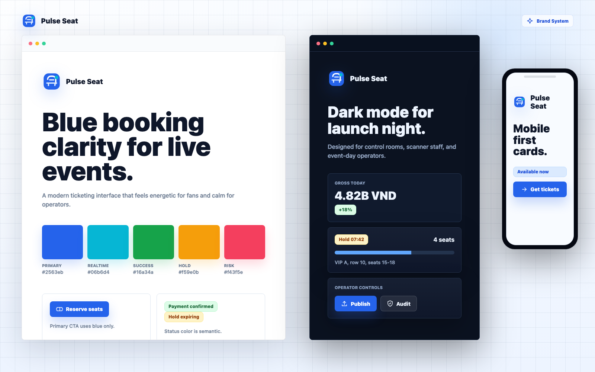
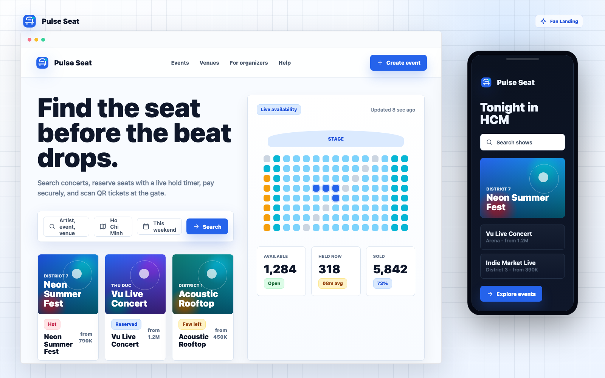
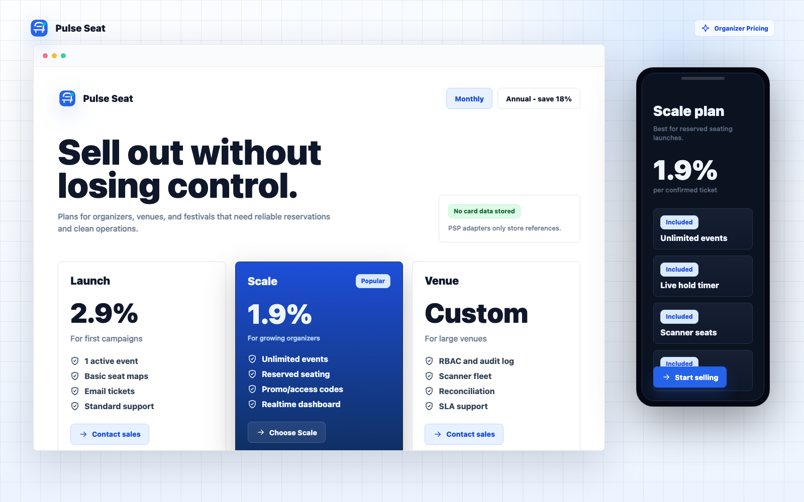
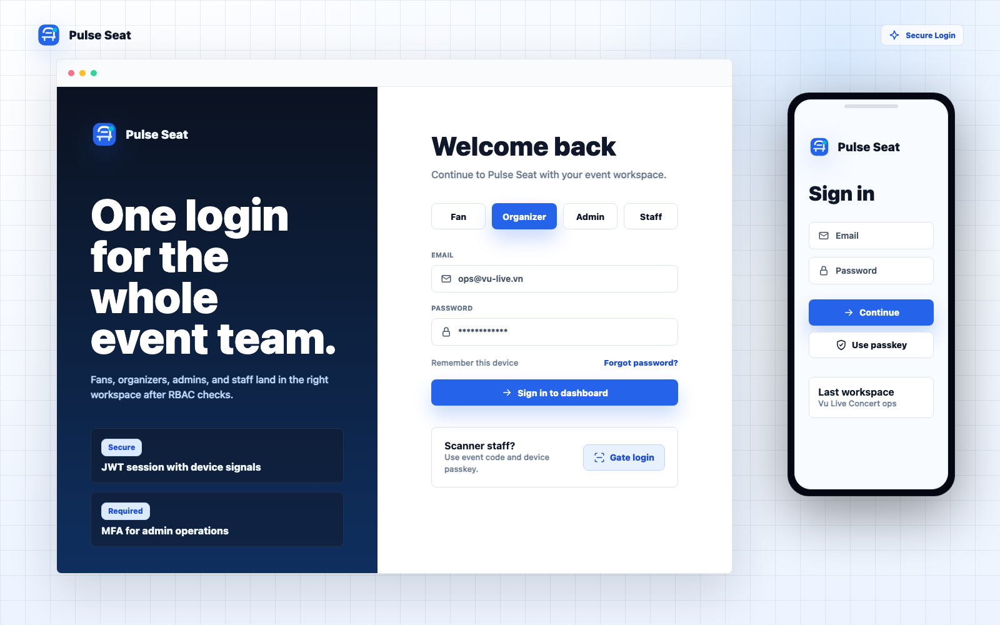
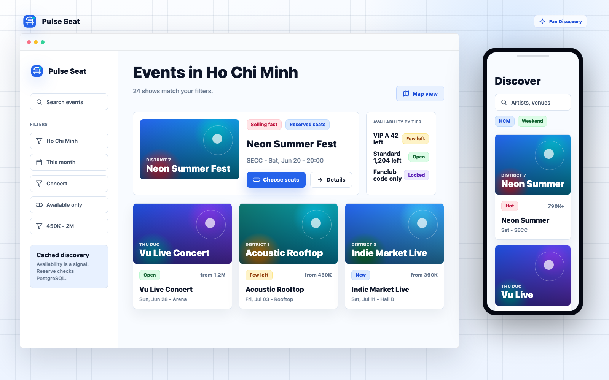
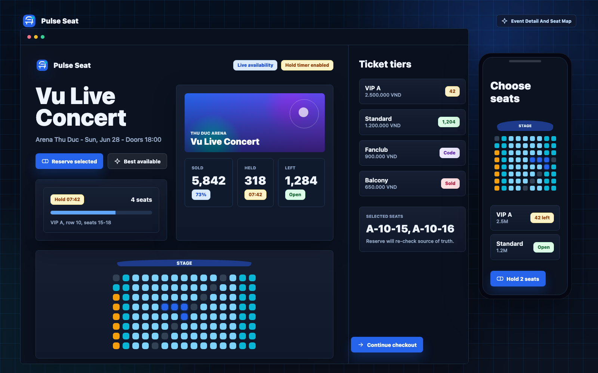
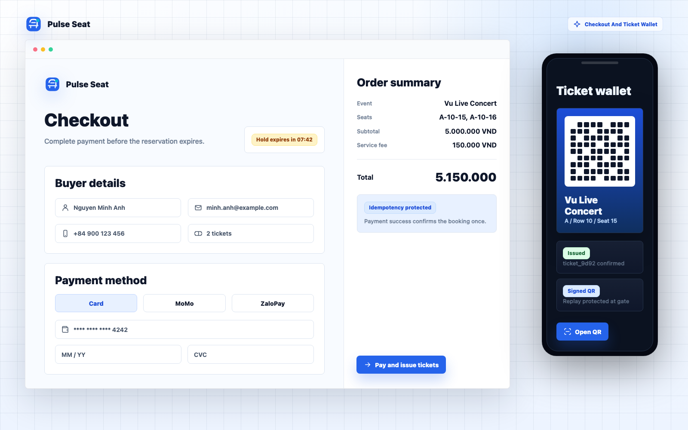
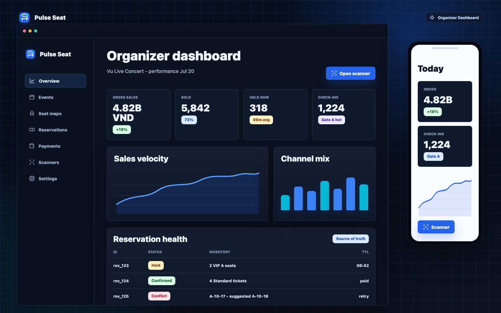
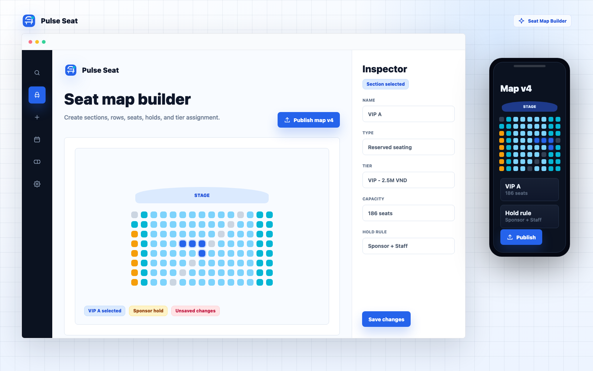
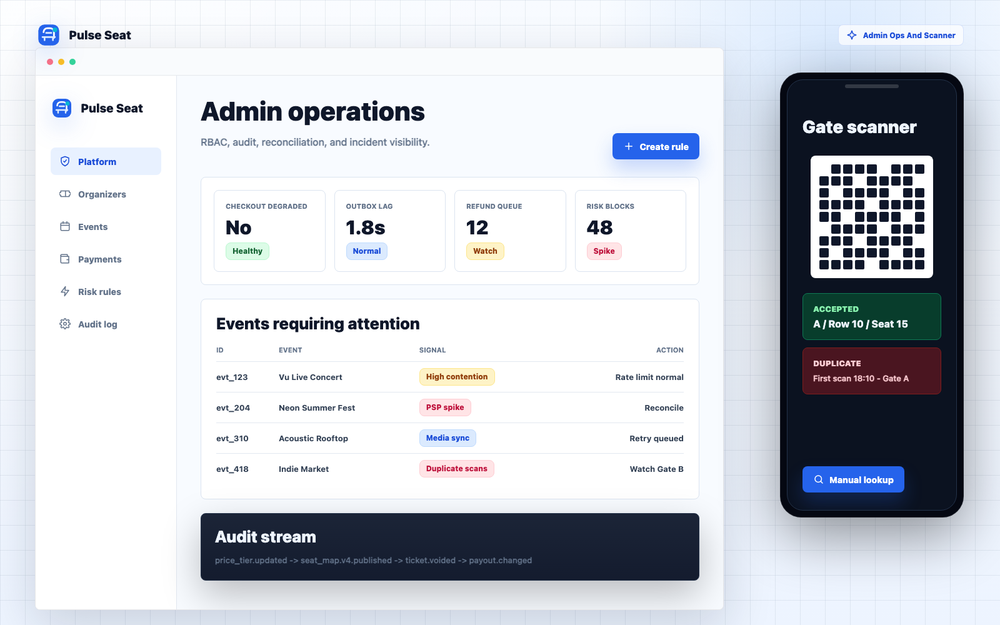

# Pulse Seat UI Mockups

Source design: [docs/pulse-seat-system-design.md](../pulse-seat-system-design.md)

This folder contains the regenerated Pulse Seat UI mockups. The direction is blue-first, modern SaaS, and booking-oriented: fast discovery for fans, strong reservation feedback, calm operator dashboards, and dark-mode surfaces for event-day workflows.

## Design Direction

- Brand: primary blue with cyan, green, amber, rose, and violet accents for semantic states.
- UI system: Inter/system typography, 8px component radius, compact tables, clear status chips, and high-contrast light/dark modes.
- Responsive coverage: each major flow includes a desktop surface plus a mobile or dark-mode companion state.
- Product scope: landing, pricing, auth, discovery, event detail, seat selection, checkout, ticket wallet, organizer analytics, seat-map building, admin operations, and scanner workflows.

## Suggested Next.js Route Map

| Area | Route |
|---|---|
| Landing | `app/(marketing)/page.tsx` |
| Pricing | `app/(marketing)/pricing/page.tsx` |
| Login | `app/(auth)/login/page.tsx` |
| Fan discovery | `app/(fan)/events/page.tsx` |
| Event detail + seat map | `app/(fan)/events/[eventId]/page.tsx` |
| Checkout | `app/(fan)/checkout/[reservationId]/page.tsx` |
| Ticket wallet | `app/(fan)/tickets/page.tsx` |
| Organizer dashboard | `app/(organizer)/dashboard/page.tsx` |
| Seat map builder | `app/(organizer)/seat-maps/[seatMapId]/page.tsx` |
| Admin operations | `app/(admin)/page.tsx` |
| Staff scanner | `app/(staff)/scanner/page.tsx` |

## Generated Screens

### 1. Brand System

Blue-first tokens, logo direction, reusable controls, and light/dark UI rules.

### 2. Fan Landing

Booking-style discovery with a premium SaaS shell and mobile hero state.

### 3. Organizer Pricing

Modern SaaS pricing, usage visibility, metered fees, and dark mobile conversion.

### 4. Secure Login

Role-aware authentication for fans, organizers, admins, and scanner staff.

### 5. Fan Discovery

Search, filters, featured events, dense list scanning, and responsive cards.

### 6. Event Detail And Seat Map

Dark-mode event detail with realtime seat availability and hold intent.

### 7. Checkout And Ticket Wallet

Reservation TTL, payment, order review, issued QR ticket, and wallet state.

### 8. Organizer Dashboard

Dense SaaS analytics, reservation health, refunds, and event-day operations.

### 9. Seat Map Builder

Venue canvas, section tools, tier inspector, staff holds, and publish workflow.

### 10. Admin Ops And Scanner

Platform risk, audit stream, reconciliation, RBAC, and gate scanner workflow.

## Reference Patterns

- Booking apps: event discovery, search-first layout, reserved seating context, ticket wallet, and QR check-in.
- Stripe, Linear, Vercel, and Retool-style SaaS: compact navigation, dense dashboards, restrained surfaces, status clarity, and dark-mode operations.
- Ticketing systems: TTL reservation holds, conflict-aware seat selection, payment confirmation, QR issuance, duplicate scan handling, and auditability.
