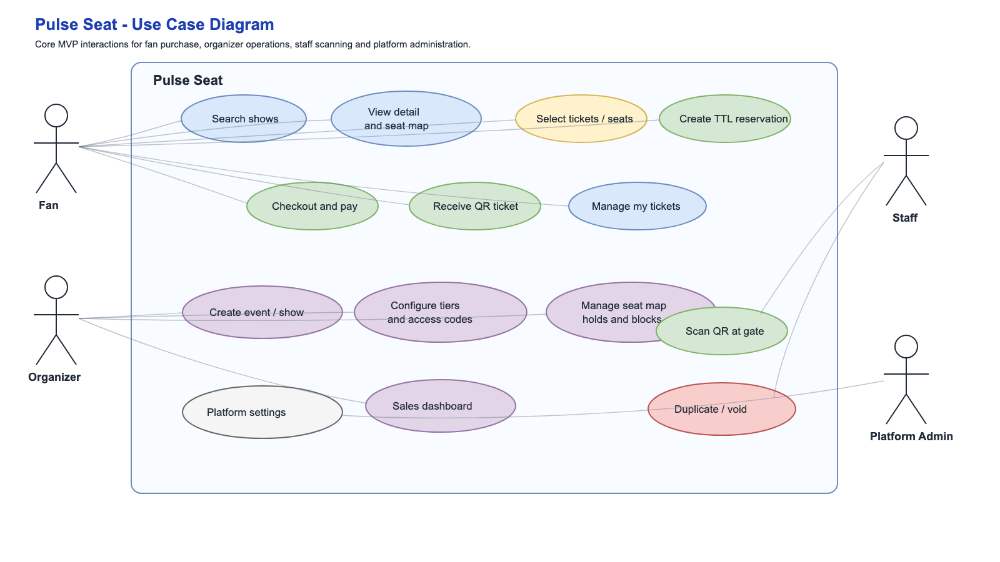
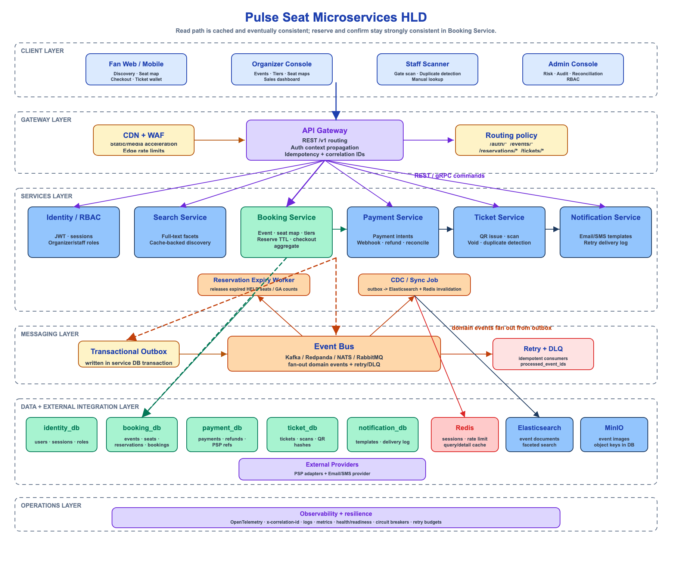
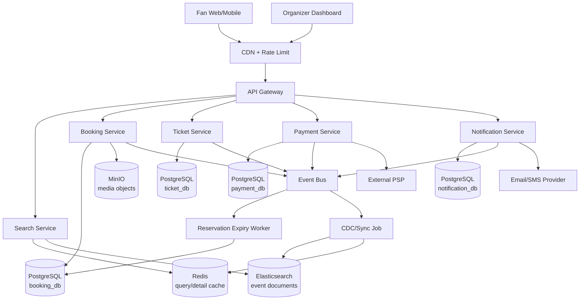
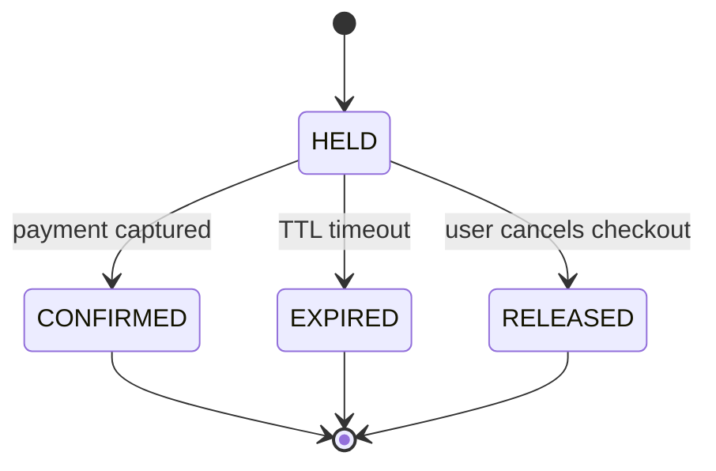
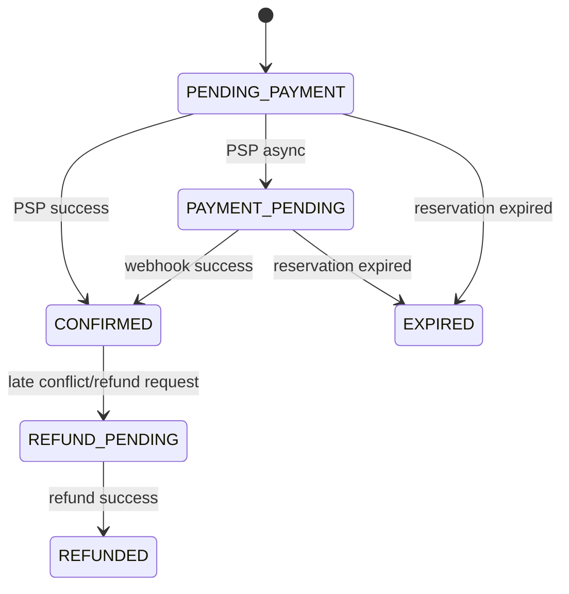
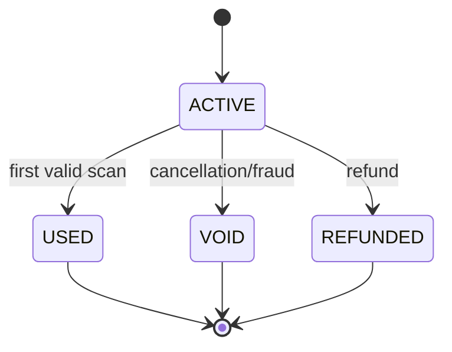
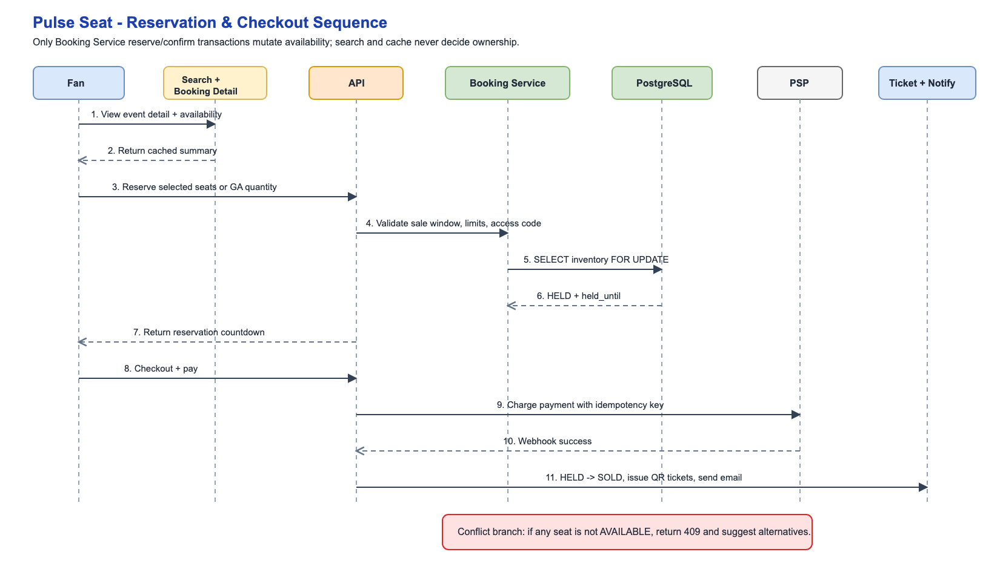
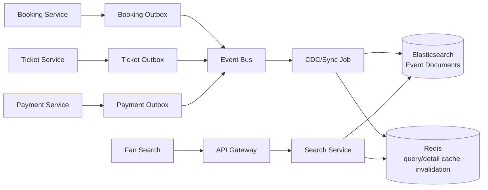
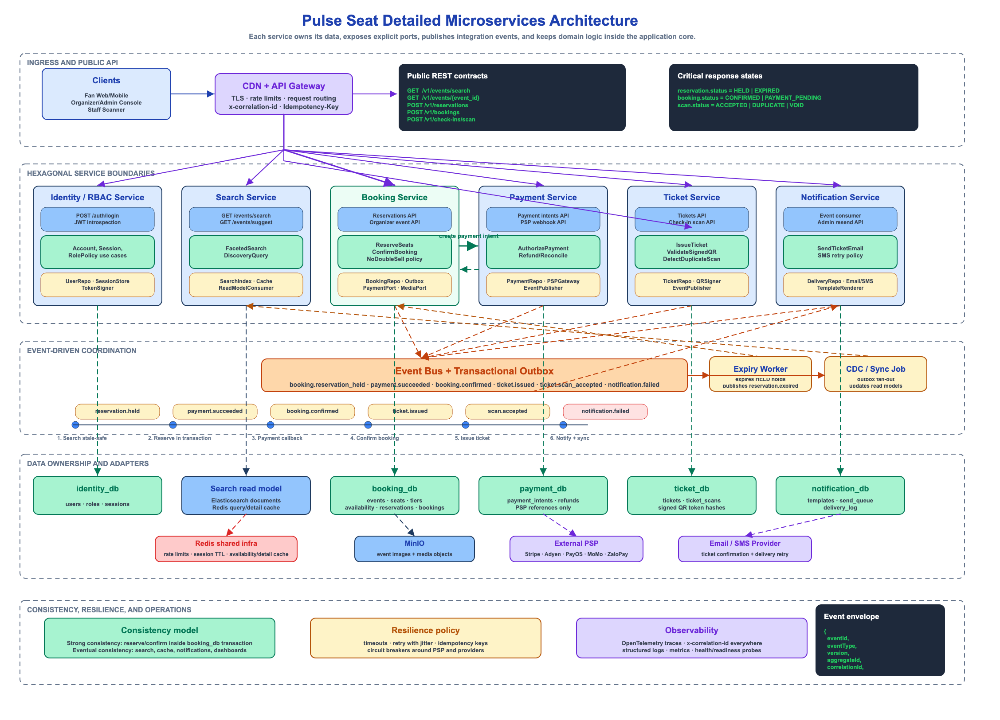
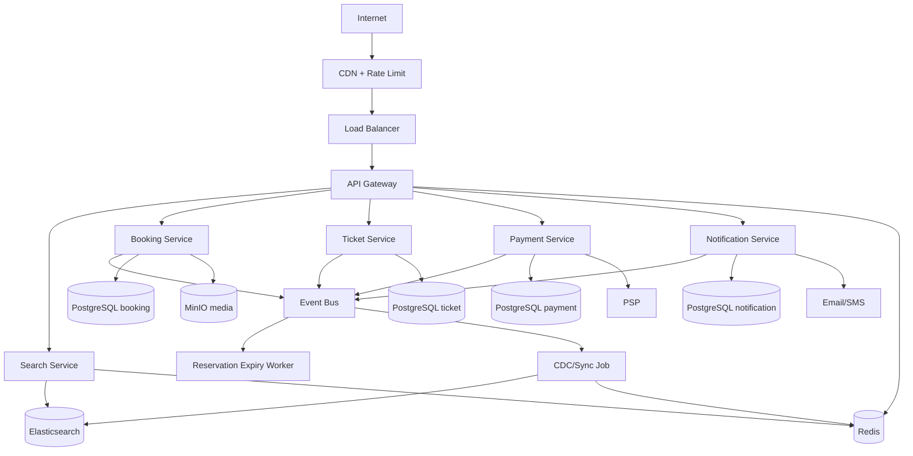

# Pulse Seat System Design

> Pulse Seat là hệ thống đặt vé show ca nhạc theo hướng Ticketbox/Eventbrite/Ticketmaster. Phase hiện tại tập trung vào use case chính: tìm show bằng Elasticsearch, xem detail/seat map, giữ vé tạm thời, thanh toán, phát hành QR ticket và quét vé tại cổng. Thiết kế này tham khảo HLD trong `system-design/design-hotel-booking-system.md`: read path có thể cache/stale ngắn hạn, còn reserve/confirm luôn kiểm tra source of truth trong PostgreSQL transaction của Booking Service.

## 0. Scope Và Giả Định

### Scope Phase Hiện Tại

- Chưa triển khai tầng phòng chờ ảo hoặc cơ chế admission token.
- Full-text search dùng Elasticsearch ngay từ phase hiện tại.
- Media/event image dùng MinIO object storage; database chỉ lưu metadata và object key.
- Backend đi theo microservices, nhưng chỉ giữ các service cần thiết cho MVP.
- Edge phase hiện tại chỉ gồm CDN, rate limit cơ bản và API Gateway.
- Chưa tối ưu cho các đợt mở bán cực lớn. Khi traffic vượt ngưỡng MVP, hệ thống ưu tiên rate limit, degradation và thông báo rõ.

### Mục Tiêu MVP

- Fan tìm show theo thành phố, ngày, nghệ sĩ, venue, thể loại và khoảng giá.
- Fan xem show detail, ticket tiers, sơ đồ venue và availability gần realtime.
- Fan chọn vé general admission theo số lượng hoặc chọn ghế reserved seating.
- Hệ thống giữ vé bằng TTL reservation trong lúc checkout, không double sell.
- Fan thanh toán qua PSP như Stripe/Adyen/PayOS/MoMo/ZaloPay adapter.
- Sau khi thanh toán thành công, hệ thống phát hành ticket QR và gửi email/SMS.
- Organizer tạo event, performance, venue/seat map, ticket tier, hold/promo/access code và xem dashboard bán vé.
- Staff quét QR tại cổng, phát hiện duplicate/void/refund ticket.

### Non-Goals Cho Version Đầu

- Không làm resale marketplace, bidding, transfer phức tạp.
- Không làm dynamic pricing ML; chỉ hỗ trợ ticket tier, early bird và promo/access code.
- Không làm multi-region active-active.
- Không tự xử lý thẻ thanh toán. Pulse Seat chỉ lưu PSP reference/token, không lưu card PAN/CVV.
- Không hỗ trợ mọi loại venue phức tạp. MVP hỗ trợ general admission và reserved seating theo section/row/seat cơ bản.
- Không yêu cầu recommendation/personalization nâng cao trong phase hiện tại.

### Tham Khảo Chính

- Hotel booking design hiện có: TTL hold, pessimistic locking, Elasticsearch search read path, search eventual consistency, outbox/CDC worker.
- Ticketmaster availability pattern: availability trong search có thể cache và không nên là nguồn quyết định purchase realtime.
- Eventbrite reserved seating: seat map, ticket tiers, holds, access code, dashboard sold/held/available là các khái niệm cốt lõi cho ticketing.

## 1. Requirements

### Use Case Diagram



### Functional Requirements

#### Fan

- Tìm kiếm show:
  - filter theo `city`, `date_range`, `artist`, `venue`, `genre`, `price_range`, `availability`.
  - sort theo ngày gần nhất, phổ biến, giá thấp.
- Xem show detail:
  - thông tin show, nghệ sĩ, lịch diễn, venue, policy, media, ticket tiers.
  - xem availability theo tier/section với cache ngắn.
- Chọn vé:
  - General admission: chọn tier + quantity.
  - Reserved seating: chọn seat cụ thể trên seat map.
  - Best available: hệ thống tự chọn ghế phù hợp theo tier/section.
- Checkout:
  - tạo reservation có TTL, nhập buyer/attendee info, áp dụng promo/access code.
  - thanh toán qua PSP.
  - nhận booking confirmation và ticket QR.
- Quản lý vé:
  - xem ticket, trạng thái thanh toán, refund/cancel policy.
  - tải hoặc mở QR ticket.

#### Organizer/Admin

- Quản lý venue và seat map:
  - tạo section, row, seat, table cơ bản.
  - gán tier/price cho seat hoặc section.
  - block/hold seat cho staff, sponsor, artist, promoter, presale.
- Quản lý show:
  - tạo event, performance, onsale/off-sale time, capacity, ticket limit.
  - tạo ticket tiers: Standard, VIP, Early Bird, Fanclub Presale.
  - tạo promo code/access code và visibility rule.
- Theo dõi bán vé:
  - sold, held, available, gross sales, refund, check-in count.
  - dashboard theo show/performance/tier/channel.
- Event-day operations:
  - staff scan QR, check-in attendee.
  - xử lý duplicate scan, void/refund ticket.

### Non-Functional Requirements

- **No double sell**: một reserved seat chỉ có tối đa một ticket confirmed. Một GA bucket không được bán vượt capacity.
- **Strong consistency cho reserve/confirm**: mọi thao tác thay đổi seat/GA availability nằm trong PostgreSQL transaction của Booking Service.
- **Eventual consistency cho search/detail**: Elasticsearch và availability cache có thể stale vài giây, nhưng reserve luôn kiểm tra PostgreSQL source of truth.
- **Traffic phase hiện tại**:
  - Discovery campaign: 500-2,000 read QPS ngắn hạn.
  - Reservation write path: 20-100 QPS cho mỗi event hot vừa phải.
  - Khi traffic vượt ngưỡng này, ưu tiên rate limit/degradation trước khi thêm tầng điều phối phức tạp.
- **Latency mục tiêu**:
  - Search p95 < 300 ms khi cache hit, p95 < 500 ms khi query Elasticsearch.
  - Show detail p95 < 500 ms.
  - Reserve p95 < 1 s trong điều kiện bình thường, có thể cao hơn ở hot seat contention.
  - Checkout phụ thuộc PSP, trả `202 PAYMENT_PENDING` khi PSP xử lý chậm.
- **Availability**:
  - Search/detail vẫn hoạt động khi checkout degraded.
  - Checkout không được confirm sai khi PSP, notification hoặc cache lỗi.
- **Auditability**: mọi thay đổi booking/reservation/ticket/payment có append-only event log.
- **Security**:
  - JWT/session cho fan, RBAC cho organizer/staff.
  - signed QR token, chống replay tại scan.
  - rate limit, access code protection và risk rule đơn giản.
  - PII encryption/masking ở các trường nhạy cảm.

## 2. Back-Of-The-Envelope Estimation

MVP sizing chưa cần scale cỡ Ticketmaster. Điểm quan trọng là thiết kế đúng cho contention ở ghế/tier, giống hotel booking: read nhiều, write ít hơn nhưng write phải chính xác.

```text
Organizers:              1K
Venues:                  2K
Active shows/year:       10K
Performances/show avg:   1.3
Avg capacity:            2K seats/tickets
Large show capacity:     20K-60K seats/tickets

Active ticket inventory:
  10K shows * 1.3 performances * 2K avg capacity
  ~= 26M sellable units/year

Search:
  DAU MVP: 100K
  searches/session: 5
  avg search QPS: 100K * 5 / 86,400 ~= 6 QPS
  campaign peak QPS: 500-2,000 QPS

Write path:
  reserve attempts during campaign: 20-100 QPS
  checkout conversion: much lower than browsing

Read:write:
  Browse/search dominates, often >100:1.
  Writes concentrate by event/tier/seat during onsale.
```

Storage:

```text
event/show metadata:        small, < 10 GB for MVP
seat availability rows:
  26M rows/year * ~100-200 bytes ~= 2.6-5.2 GB raw/year
bookings:
  1M bookings/year * ~1 KB ~= 1 GB/year
tickets:
  2M tickets/year * ~1 KB ~= 2 GB/year
audit events:
  manageable in PostgreSQL for MVP
media:
  MinIO + CDN, DB stores metadata/object keys only
```

Kết luận phase hiện tại: PostgreSQL, Redis, Elasticsearch, MinIO và event bus đủ để ship MVP. Điểm khó nằm ở transaction reserve/confirm, event consistency giữa services và UX khi conflict.

## 3. Architecture Style

### Service Boundaries Phase Hiện Tại

Version hiện tại dùng **microservices** bằng Go, nhưng không chia nhỏ theo từng CRUD module. Chỉ giữ đúng các deployable service/job sau:

| Service/Job | Trách nhiệm | Data ownership |
|---|---|---|
| Search Service | full-text/faceted search, đọc Redis/Elasticsearch, trả kết quả discovery | Elasticsearch read model, search cache keys, sync checkpoints |
| Ticket Service | phát hành QR ticket, void/refund ticket state, check-in scan, duplicate detection | tickets, ticket_scans, QR token hashes |
| Booking Service | event/performance/venue/seat map/tier, availability, reservation TTL, checkout aggregate, organizer dashboard data | events, performances, venues, seat maps, tiers, availability rows, reservations, bookings |
| Payment Service | payment intent, PSP webhook, refund/reversal, reconciliation | payments, refunds, PSP references |
| Notification Service | email/SMS templates, send queue, retry, delivery log | notification logs, templates |
| Reservation Expiry Worker | expire held reservations, release seats/GA counts, publish expiry events | updates Booking Service tables through owned worker code |
| CDC/Sync Job | publish outbox/CDC events, update Elasticsearch, invalidate Redis, maintain lightweight read models | outbox checkpoints, DLQ/retry state |

Edge/infrastructure components không tính là application service:

- API Gateway: routing, auth context propagation, rate limit, response composition.
- CDN: static/media acceleration.
- PostgreSQL: source of truth for service-owned tables.
- Redis: query cache, detail cache, availability summary cache, rate limit counters.
- Elasticsearch: search read model.
- MinIO: S3-compatible media storage.
- Event bus: Kafka-compatible Redpanda, NATS JetStream hoặc RabbitMQ.

Data ownership rules:

- PostgreSQL có thể chạy cùng một managed cluster ban đầu, nhưng mỗi service sở hữu schema/database và migration riêng.
- Service khác không query table trực tiếp; cross-service reads đi qua API hoặc read model.
- Booking Service là consistency boundary quan trọng nhất cho reserve/confirm.
- Payment Service không tự đổi seat availability; nó publish payment event để Booking Service confirm.
- Ticket Service chỉ issue ticket sau khi nhận `booking.confirmed`.
- CDC/Sync Job và consumers phải idempotent, track processed event IDs.

Checkout consistency model:

- Reservation được tạo và confirm trong Booking Service transaction.
- Booking Service orchestrates checkout theo 3 phase giống hotel design: hold -> charge payment -> confirm.
- Payment success trigger idempotent confirm trong Booking Service.
- Nếu reservation expired trước khi payment success, Payment Service tạo refund/reversal job và Booking chuyển sang `EXPIRED` hoặc `REFUND_PENDING`.

## 4. High-Level Architecture

### Excalidraw HLD





### Runtime Flow Theo Read/Write Split

- **Discovery read path**: Fan -> CDN/rate limit -> API Gateway -> Search Service -> Redis cache -> Elasticsearch. Kết quả nhanh, availability chỉ là tín hiệu gần realtime.
- **Show detail path**: Fan -> API Gateway -> Booking Service. Booking Service trả metadata, tier, seat map và availability summary; cache có TTL ngắn.
- **Reserve write path**: Fan -> API Gateway -> Booking Service -> PostgreSQL transaction với row locks -> reservation `HELD`.
- **Checkout write path**: Booking Service tạo payment intent -> Payment Service/PSP -> Booking Service confirm -> Ticket Service issue tickets -> Notification Service gửi email/SMS.
- **Async path**: service ghi outbox -> event bus -> CDC/Sync Job update Elasticsearch/Redis/read models; Notification Service xử lý side effects không ảnh hưởng confirm.

## 5. API Design

REST/JSON là đủ cho MVP. Dùng `/v1`, `Idempotency-Key` cho write endpoints, `X-Correlation-Id` cho tracing.

### 5.1 Search Events

```http
GET /v1/events/search?city=HCM&date_from=2026-07-01&date_to=2026-07-31&artist=vu&genre=pop&availability=available&page_size=20&cursor=...
```

Response:

```json
{
  "items": [
    {
      "event_id": "evt_123",
      "slug": "vu-concert-hcm-2026",
      "title": "Vu Live Concert",
      "artists": ["Vu"],
      "venue": {
        "name": "SECC Hall A",
        "city": "HCM"
      },
      "starts_at": "2026-07-20T20:00:00+07:00",
      "min_price": 750000,
      "currency": "VND",
      "availability_status": "AVAILABLE",
      "thumbnail_url": "https://cdn.example.com/events/evt_123.jpg"
    }
  ],
  "next_cursor": "eyJzb3J0IjpbIjIwMjYtMDctMjAiLCJldnRfMTIzIl19",
  "total_count": 128
}
```

### 5.2 Get Event Detail

```http
GET /v1/events/{event_id}
```

Response:

```json
{
  "event_id": "evt_123",
  "title": "Vu Live Concert",
  "description": "...",
  "artists": ["Vu"],
  "performances": [
    {
      "performance_id": "perf_123",
      "starts_at": "2026-07-20T20:00:00+07:00",
      "venue": {
        "venue_id": "ven_456",
        "name": "SECC Hall A",
        "city": "HCM"
      },
      "tiers": [
        {
          "tier_id": "tier_vip",
          "name": "VIP",
          "price": 2500000,
          "currency": "VND",
          "availability_status": "FEW_LEFT"
        }
      ]
    }
  ],
  "media": [
    {
      "type": "image",
      "url": "https://cdn.example.com/events/evt_123/banner.jpg"
    }
  ],
  "policies": {
    "refund": "No refund after purchase",
    "age": "All ages"
  }
}
```

### 5.3 Get Seat Map Availability

```http
GET /v1/performances/{performance_id}/seat-map?section_id=sec_A
```

Response:

```json
{
  "performance_id": "perf_123",
  "seat_map_version": 4,
  "sections": [
    {
      "section_id": "sec_A",
      "name": "A",
      "seating_type": "RESERVED",
      "availability_summary": {
        "available": 120,
        "few_left": false
      }
    }
  ],
  "seats": [
    {
      "seat_id": "seat_A_10_15",
      "label": "A-10-15",
      "row": "10",
      "number": "15",
      "tier_id": "tier_vip",
      "status": "AVAILABLE",
      "x": 320.5,
      "y": 144.0
    }
  ]
}
```

### 5.4 Reserve Tickets

```http
POST /v1/reservations
Authorization: Bearer <jwt>
Idempotency-Key: idem_123
```

Reserved seating request:

```json
{
  "performance_id": "perf_123",
  "items": [
    {
      "type": "RESERVED_SEAT",
      "seat_id": "seat_A_10_15",
      "tier_id": "tier_vip"
    }
  ],
  "access_code": "FANCLUB"
}
```

General admission request:

```json
{
  "performance_id": "perf_123",
  "items": [
    {
      "type": "GENERAL_ADMISSION",
      "tier_id": "tier_standard",
      "section_id": "floor",
      "quantity": 2
    }
  ]
}
```

Response:

```json
{
  "reservation_id": "rsv_123",
  "status": "HELD",
  "held_until": "2026-07-20T19:05:00+07:00",
  "total_price": 5000000,
  "currency": "VND",
  "checkout_url": "/checkout/rsv_123"
}
```

Conflict:

```json
{
  "error": {
    "code": "TICKET_NOT_AVAILABLE",
    "message": "Selected seat is no longer available",
    "alternatives": [
      {
        "seat_id": "seat_A_10_16",
        "tier_id": "tier_vip"
      }
    ]
  }
}
```

### 5.5 Checkout And Payment

```http
POST /v1/bookings
Authorization: Bearer <jwt>
Idempotency-Key: idem_checkout_123
```

Request:

```json
{
  "reservation_id": "rsv_123",
  "buyer": {
    "name": "Nguyen Van A",
    "email": "a@example.com",
    "phone": "+84912345678"
  },
  "attendees": [
    {
      "name": "Nguyen Van A",
      "email": "a@example.com"
    }
  ],
  "payment_method": {
    "provider": "stripe",
    "token": "tok_visa_4242"
  }
}
```

Synchronous success:

```json
{
  "booking_id": "bk_123",
  "status": "CONFIRMED",
  "payment_status": "CAPTURED",
  "ticket_ids": ["tkt_123"],
  "confirmation_url": "/bookings/bk_123"
}
```

Async payment:

```json
{
  "booking_id": "bk_123",
  "status": "PAYMENT_PENDING",
  "payment_status": "PROCESSING",
  "poll_url": "/v1/bookings/bk_123"
}
```

### 5.6 Ticket And Check-In

```http
GET /v1/tickets/{ticket_id}
POST /v1/tickets/{ticket_id}/void
POST /v1/check-ins/scan
```

Scan request:

```json
{
  "qr_token": "signed.compact.token",
  "device_id": "gate-a-01",
  "gate": "Gate A"
}
```

Scan response:

```json
{
  "status": "ACCEPTED",
  "ticket_id": "tkt_123",
  "seat_label": "A / Row 10 / Seat 15",
  "attendee_name": "Nguyen Van A"
}
```

Duplicate scan:

```json
{
  "status": "REJECTED",
  "reason": "ALREADY_USED",
  "first_scanned_at": "2026-07-20T18:10:00+07:00",
  "first_device": "Gate A - device 01"
}
```

## 6. Core Data Model

Mỗi service sở hữu database/schema PostgreSQL riêng. Production có thể dùng cùng managed PostgreSQL cluster để giảm chi phí, nhưng không dùng chung schema và không query chéo trực tiếp. Money stored as integer in smallest currency unit, timezone explicit, all write endpoints idempotent.

### 6.1 Booking Service Database

Event, venue, media, seat map và ticket tier:

```text
artists
  id BIGINT PK
  external_id VARCHAR UNIQUE
  name VARCHAR
  slug VARCHAR UNIQUE
  metadata JSONB

venues
  id BIGINT PK
  external_id VARCHAR UNIQUE
  name VARCHAR
  address TEXT
  city VARCHAR
  country CHAR(2)
  timezone VARCHAR
  latitude DECIMAL
  longitude DECIMAL

events
  id BIGINT PK
  external_id VARCHAR UNIQUE
  organizer_id BIGINT
  title VARCHAR
  slug VARCHAR UNIQUE
  description TEXT
  status VARCHAR CHECK (status IN ('DRAFT','PUBLISHED','CANCELLED','ARCHIVED'))
  genre VARCHAR
  photos JSONB
  policies JSONB
  created_at TIMESTAMP
  updated_at TIMESTAMP

media_assets
  id BIGINT PK
  owner_type VARCHAR
  owner_id BIGINT
  object_key VARCHAR UNIQUE
  checksum VARCHAR
  size_bytes BIGINT
  content_type VARCHAR
  created_at TIMESTAMPTZ

performances
  id BIGINT PK
  external_id VARCHAR UNIQUE
  event_id BIGINT FK
  venue_id BIGINT FK
  starts_at TIMESTAMPTZ
  doors_open_at TIMESTAMPTZ
  timezone VARCHAR
  status VARCHAR CHECK (status IN ('DRAFT','ONSALE','SOLD_OUT','COMPLETED','CANCELLED'))
  onsale_starts_at TIMESTAMPTZ
  offsale_at TIMESTAMPTZ
  ticket_limit_per_order SMALLINT DEFAULT 6

seat_maps
  id BIGINT PK
  venue_id BIGINT FK
  name VARCHAR
  version INT
  status VARCHAR CHECK (status IN ('DRAFT','ACTIVE','ARCHIVED'))
  layout_json JSONB

sections
  id BIGINT PK
  seat_map_id BIGINT FK
  name VARCHAR
  label VARCHAR
  seating_type VARCHAR CHECK (seating_type IN ('RESERVED','GENERAL_ADMISSION'))
  capacity INT
  geometry JSONB

seats
  id BIGINT PK
  section_id BIGINT FK
  row_label VARCHAR
  seat_number VARCHAR
  seat_label VARCHAR
  x DECIMAL
  y DECIMAL
  status VARCHAR CHECK (status IN ('ACTIVE','REMOVED','ACCESSIBLE','OBSTRUCTED'))
  UNIQUE(section_id, row_label, seat_number)

ticket_tiers
  id BIGINT PK
  performance_id BIGINT FK
  name VARCHAR
  code VARCHAR
  price BIGINT
  currency CHAR(3)
  sale_starts_at TIMESTAMPTZ
  sale_ends_at TIMESTAMPTZ
  visibility VARCHAR CHECK (visibility IN ('PUBLIC','ACCESS_CODE','HIDDEN'))
  max_per_order SMALLINT
```

Reserved seating source of truth:

```text
seat_availability
  performance_id BIGINT FK
  seat_id BIGINT FK
  tier_id BIGINT FK
  status VARCHAR CHECK (status IN ('AVAILABLE','HELD','SOLD','BLOCKED','VOID'))
  reservation_id BIGINT NULL
  booking_id BIGINT NULL
  held_until TIMESTAMPTZ NULL
  version INT NOT NULL DEFAULT 0
  updated_at TIMESTAMPTZ
  PRIMARY KEY (performance_id, seat_id)
  INDEX (performance_id, tier_id, status)
  INDEX (status, held_until)
  CHECK (
    (status = 'HELD' AND reservation_id IS NOT NULL AND held_until IS NOT NULL)
    OR status <> 'HELD'
  )
```

General admission source of truth:

```text
ga_availability_buckets
  id BIGINT PK
  performance_id BIGINT FK
  tier_id BIGINT FK
  section_id BIGINT FK NULL
  total_capacity INT NOT NULL
  held_count INT NOT NULL DEFAULT 0
  sold_count INT NOT NULL DEFAULT 0
  available_count INT GENERATED ALWAYS AS (total_capacity - held_count - sold_count) STORED
  updated_at TIMESTAMPTZ
  UNIQUE(performance_id, tier_id, section_id)
  CHECK (held_count + sold_count <= total_capacity)
```

Reservation and booking:

```text
reservations
  id BIGINT PK
  external_id VARCHAR UNIQUE
  idempotency_key VARCHAR UNIQUE
  user_id BIGINT FK
  performance_id BIGINT FK
  status VARCHAR CHECK (status IN ('HELD','CONFIRMED','EXPIRED','RELEASED'))
  held_until TIMESTAMPTZ
  total_price BIGINT
  currency CHAR(3)
  created_at TIMESTAMPTZ
  updated_at TIMESTAMPTZ
  INDEX (status, held_until)

reservation_items
  id BIGINT PK
  reservation_id BIGINT FK
  item_type VARCHAR CHECK (item_type IN ('RESERVED_SEAT','GENERAL_ADMISSION'))
  seat_id BIGINT NULL
  tier_id BIGINT FK
  section_id BIGINT NULL
  quantity INT NOT NULL DEFAULT 1
  unit_price BIGINT

bookings
  id BIGINT PK
  external_id VARCHAR UNIQUE
  idempotency_key VARCHAR UNIQUE
  reservation_id BIGINT FK UNIQUE
  user_id BIGINT FK
  buyer_name VARCHAR
  buyer_email VARCHAR
  buyer_phone VARCHAR
  total_amount BIGINT
  currency CHAR(3)
  status VARCHAR CHECK (status IN ('PENDING_PAYMENT','PAYMENT_PENDING','CONFIRMED','CANCELLED','EXPIRED','REFUND_PENDING','REFUNDED'))
  confirmed_at TIMESTAMPTZ NULL
  cancelled_at TIMESTAMPTZ NULL
  created_at TIMESTAMPTZ
  updated_at TIMESTAMPTZ

booking_items
  id BIGINT PK
  booking_id BIGINT FK
  reservation_item_id BIGINT FK
  attendee_name VARCHAR
  attendee_email VARCHAR
```

### 6.2 Payment Service Database

```text
payments
  id BIGINT PK
  booking_id BIGINT
  provider VARCHAR
  provider_payment_id VARCHAR
  amount BIGINT
  currency CHAR(3)
  status VARCHAR CHECK (status IN ('INITIATED','AUTHORIZED','CAPTURED','FAILED','REFUNDED'))
  raw_webhook JSONB
  created_at TIMESTAMPTZ
  updated_at TIMESTAMPTZ

refunds
  id BIGINT PK
  payment_id BIGINT FK
  provider_refund_id VARCHAR
  amount BIGINT
  status VARCHAR CHECK (status IN ('REQUESTED','SUCCEEDED','FAILED'))
  reason VARCHAR
  created_at TIMESTAMPTZ
  updated_at TIMESTAMPTZ
```

### 6.3 Ticket Service Database

```text
tickets
  id BIGINT PK
  external_id VARCHAR UNIQUE
  booking_id BIGINT
  performance_id BIGINT
  seat_id BIGINT NULL
  tier_id BIGINT
  attendee_name VARCHAR
  attendee_email VARCHAR
  qr_token_hash VARCHAR UNIQUE
  status VARCHAR CHECK (status IN ('ACTIVE','USED','VOID','REFUNDED'))
  issued_at TIMESTAMPTZ
  used_at TIMESTAMPTZ NULL

ticket_scans
  id BIGINT PK
  ticket_id BIGINT FK
  staff_user_id BIGINT
  device_id VARCHAR
  gate VARCHAR
  result VARCHAR CHECK (result IN ('ACCEPTED','DUPLICATE','VOID','INVALID','OFFLINE_ACCEPTED'))
  scanned_at TIMESTAMPTZ
  metadata JSONB
```

### 6.4 Notification Service Database

```text
notification_templates
  id BIGINT PK
  code VARCHAR UNIQUE
  channel VARCHAR CHECK (channel IN ('EMAIL','SMS'))
  subject_template TEXT
  body_template TEXT
  created_at TIMESTAMPTZ
  updated_at TIMESTAMPTZ

notification_logs
  id BIGINT PK
  event_id VARCHAR UNIQUE
  recipient VARCHAR
  channel VARCHAR
  template_code VARCHAR
  status VARCHAR CHECK (status IN ('PENDING','SENT','FAILED','RETRYING'))
  retry_count INT DEFAULT 0
  provider_message_id VARCHAR NULL
  created_at TIMESTAMPTZ
  sent_at TIMESTAMPTZ NULL
```

### 6.5 Audit And Outbox

Booking, Payment, Ticket và Notification Service đều có `domain_events` và `outbox_messages` trong schema của mình. Event bus chỉ nhận event đã commit, tránh dual-write giữa database và broker.

```text
domain_events
  id BIGINT PK
  aggregate_type VARCHAR
  aggregate_id VARCHAR
  event_type VARCHAR
  event_version INT
  payload JSONB
  correlation_id VARCHAR
  created_at TIMESTAMPTZ

outbox_messages
  id BIGINT PK
  topic VARCHAR
  key VARCHAR
  payload JSONB
  status VARCHAR CHECK (status IN ('PENDING','PUBLISHED','FAILED'))
  retry_count INT DEFAULT 0
  created_at TIMESTAMPTZ
  published_at TIMESTAMPTZ NULL
```

## 7. Booking And Reservation Design

### 7.1 State Machines

Reservation:



Booking:



Ticket:



### 7.2 Reserved Seat Hold Algorithm

### Draw.io Sequence Diagram



```text
Input: performance_id, seat_ids[], tier_id, user_id, idempotency_key

1. Check idempotency_key. If seen, return previous reservation.
2. Validate onsale window, access code, ticket limit and user active hold limit.
3. BEGIN TX
4. SELECT * FROM seat_availability
   WHERE performance_id = ? AND seat_id IN (...)
   FOR UPDATE;
5. Check all rows exist and status = AVAILABLE.
6. Optional seat rule: do not leave a single stranded seat in the same row/group.
7. INSERT reservations(status=HELD, held_until=NOW()+7min).
8. INSERT reservation_items for each seat.
9. UPDATE seat_availability
   SET status='HELD', reservation_id=?, held_until=?, version=version+1
   WHERE performance_id=? AND seat_id IN (...) AND status='AVAILABLE';
10. Assert affected_rows = number of selected seats.
11. INSERT domain_events + outbox_messages in same TX.
12. COMMIT
```

Why pessimistic locking:

- Seat/ticket purchase is a low-write, high-value critical path.
- Under contention, retry storms from optimistic locking create worse user experience.
- PostgreSQL row locks serialize conflicting seat attempts and keep correctness simple.
- DB constraints are the final safety net.

### 7.3 General Admission Hold Algorithm

```text
Input: performance_id, tier_id, section_id, quantity

1. BEGIN TX
2. SELECT * FROM ga_availability_buckets
   WHERE performance_id=? AND tier_id=? AND section_id IS NOT DISTINCT FROM ?
   FOR UPDATE;
3. Check available_count >= quantity.
4. INSERT reservation + reservation_items(quantity).
5. UPDATE ga_availability_buckets
   SET held_count = held_count + quantity
   WHERE id=?;
6. CHECK constraint guarantees held_count + sold_count <= total_capacity.
7. COMMIT
```

### 7.4 Confirm After Payment

Payment success path:

```text
1. PSP webhook/callback arrives at Payment Service with provider_payment_id.
2. Payment Service verifies signature and idempotency, stores payment CAPTURED.
3. Payment Service publishes payment.captured through its outbox.
4. Booking Service consumes payment.captured and confirms reservation/booking:
   - BEGIN TX
   - SELECT reservation/items/booking FOR UPDATE.
   - If reservation status != HELD:
     - if already CONFIRMED, return idempotent success.
     - if EXPIRED/RELEASED, publish booking.refund_required.
   - Update reservation -> CONFIRMED.
   - Update booking -> CONFIRMED.
   - Reserved seats: HELD -> SOLD.
   - GA buckets: held_count -= quantity, sold_count += quantity.
   - Insert booking.confirmed + outbox messages.
   - COMMIT.
5. Ticket Service consumes booking.confirmed and issues signed QR tickets.
6. Notification Service consumes ticket.issued/booking.confirmed and sends confirmation email/SMS.
```

Expiry race:

- Reservation Expiry Worker và payment confirm đều update với condition `WHERE status = 'HELD'`.
- Chỉ một transaction thắng.
- Nếu PSP success đến sau khi reservation expired, Booking Service không confirm vé; Payment Service tạo refund/reversal job.
- Thêm grace period 15-30 giây cho expiry worker để giảm refund do PSP chậm.

### 7.5 Expiry Worker

```text
Runs every 15-30 seconds:
1. Find reservations where status='HELD' and held_until < NOW() - grace_period.
2. Lock reservation row.
3. If still HELD:
   - Reserved seats: status HELD -> AVAILABLE, clear reservation_id/held_until.
   - GA buckets: held_count -= quantity.
   - Reservation -> EXPIRED.
   - Booking -> EXPIRED if exists and pending.
4. Publish reservation.expired and availability.released.
5. CDC/Sync Job updates Elasticsearch, dashboard read models and Redis keys.
```

### 7.6 Anti-Abuse Cơ Bản

- Max active holds per user: 1-3 depending risk score.
- Max tickets per booking per event, enforced in DB/application.
- Rate limit by user, IP, device fingerprint.
- Risk check before reserve for suspicious traffic.
- Reservation TTL short: 5-7 minutes for high demand, 10 minutes for normal events.
- Cancel abandoned carts promptly.
- Monitor hold-to-confirm ratio by event/user/IP.

## 8. Search And Availability Read Path

### Consistency Policy

- Search result is a discovery surface, not a promise.
- Show availability status as `AVAILABLE`, `FEW_LEFT`, `SOLD_OUT`, not always exact seat count.
- Show exact seat state only in seat map/detail page, still verified at reserve time.
- On any `409 TICKET_NOT_AVAILABLE`, UI suggests nearby seats/tier and keeps user in checkout context.

### Elasticsearch Search Pipeline



Implementation notes:

- Cache key = normalized query params + page cursor.
- TTL:
  - Search result: 30-120 seconds depending event heat.
  - Event detail: 15-60 seconds.
  - Availability summary: 5-15 seconds.
- Elasticsearch event document includes:
  - event/performance metadata: title, artist names, genre, tags, venue, city, geo point.
  - searchable fields with analyzers for Vietnamese/English artist and venue names.
  - filter/sort fields: starts_at, min_price, availability_status, city, genre, organizer.
  - lightweight availability summary by performance/tier; exact seat state stays in Booking Service.
- PostgreSQL indexes still exist inside owning services for transactional queries, but full-text/faceted discovery goes through Elasticsearch.
- Cache invalidation:
  - Reservation created/expired/confirmed invalidates affected performance/tier/section keys.
  - Event or ticket tier updates invalidate event detail/search keys.
- Search Service must tolerate index staleness. Any checkout `409 TICKET_NOT_AVAILABLE` is handled by UI suggestions from Booking Service.

This follows the hotel booking pattern: Elasticsearch handles read-heavy discovery, while write path must re-check availability in the source-of-truth transaction.

## 9. Organizer And Staff UX Principles

Dashboard là operational tool, ưu tiên quét thông tin nhanh và thao tác lặp lại hiệu quả.

### Fan UX

- First screen của event detail phải cho thấy show, date, venue, price và CTA chọn vé.
- Seat map phải có legend rõ: available, held, sold, blocked, selected, accessible.
- Khi availability stale, copy nên trung thực: "Vé có thể thay đổi trong lúc chọn".
- Khi reserve conflict, không đẩy user về đầu flow. Giữ context và đề xuất seat/tier thay thế.
- Checkout có countdown TTL dễ thấy, nhưng không gây hoảng loạn.

### Organizer Dashboard

- Persistent sidebar:
  - Events, Performances, Seat Maps, Bookings, Attendees, Promotions, Reports, Settings.
- Event workspace:
  - tabs: Overview, Tickets, Seat Map, Holds, Bookings, Analytics.
- Seat map editor:
  - icon tools for select, pan, section, row, seat, table, hold.
  - swatches for tier/hold color.
  - right inspector for selected section/seat/tier.
- Data tables:
  - filters by status/tier/channel/date.
  - sticky headers, pagination, export CSV.
## 10. Resilience, Observability, Operations

### Resilience

- PSP calls use timeout, retry with jitter and idempotency key.
- PSP webhook handler must be idempotent.
- Notification failures never roll back confirmed booking.
- Search Service fallback:
  - Redis cache hit can serve stale for short time.
  - If Elasticsearch down, return degraded "try again" response with popular events from cache.
- Booking Service:
  - lock timeout returns `409` or `503` with retry-after depending reason.
  - no external call inside seat/GA lock transaction.
- Payment Service:
  - stores PSP raw webhook before processing.
  - reconciliation job compares local payments with PSP records.
- Ticket Service:
  - scan endpoint locks ticket row or uses atomic update `ACTIVE -> USED`.
  - duplicate scan returns deterministic previous scan info.

### Observability

- Propagate `X-Correlation-Id` through API, services and event headers.
- Metrics:
  - search latency, cache hit rate, Elasticsearch error rate.
  - reservation success/conflict/timeout rate.
  - lock wait time by performance/tier.
  - hold-to-confirm ratio.
  - PSP success/failure/webhook latency.
  - ticket issue latency and scan accepted/rejected count.
  - CDC lag, outbox backlog, DLQ count.
- Logs:
  - structured JSON logs with event_id, performance_id, reservation_id, booking_id, payment_id.
  - redact PII and QR tokens.
- Traces:
  - Search request.
  - Reserve transaction.
  - Checkout/payment.
  - Payment webhook -> booking confirm -> ticket issue -> notification.

### Operational Runbooks

- Hot event contention:
  - reduce reservation TTL.
  - tighten active hold limit.
  - show "high demand" UI copy.
  - monitor lock wait and conflict rate.
- Elasticsearch lag:
  - show approximate availability.
  - rely on Booking Service at reserve.
  - scale CDC/Sync Job consumers.
- PSP incident:
  - pause new checkout if provider unavailable.
  - keep existing reservations until TTL/grace.
  - reconcile payments before issuing/refunding.
- Event cancellation:
  - mark performance cancelled.
  - stop sales.
  - void/refund tickets through async workflow.
  - notify buyers.

## 11. Security And Privacy

- JWT/session auth with short-lived access token and refresh token.
- RBAC roles: `FAN`, `ORGANIZER_OWNER`, `ORGANIZER_STAFF`, `CHECK_IN_STAFF`, `ADMIN`.
- Organizer/staff authorization is scoped by organizer/event/performance.
- Signed QR token:
  - contains ticket id, event/performance id, nonce and expiry/issued-at.
  - DB stores token hash only.
  - rotate signing keys with key id.
- Payment:
  - never store card PAN/CVV.
  - verify PSP webhook signature.
  - idempotency for capture/refund.
- PII:
  - encrypt sensitive buyer/attendee fields at rest if possible.
  - mask email/phone in logs/admin views.
  - retention policy for old attendees and scan logs.
- Admin actions:
  - audit log for price/tier/seat map/policy changes.
  - require higher privilege for cancellation/refund/void.

## 12. Deployment Plan

### Excalidraw System Architecture



### MVP Local

- API Gateway + services as separate Go processes or docker-compose services.
- Search Service.
- Booking Service.
- Ticket Service.
- Payment Service.
- Notification Service.
- Reservation Expiry Worker.
- CDC/Sync Job.
- PostgreSQL.
- Redis.
- Elasticsearch.
- Event bus: Kafka-compatible Redpanda, NATS JetStream or RabbitMQ.
- MinIO for media.

### MVP Production



Recommended first production setup:

- 2 API Gateway replicas.
- 1-2 replicas cho Search Service, Booking Service, Ticket Service, Payment Service, Notification Service.
- 1-2 replicas cho Reservation Expiry Worker và CDC/Sync Job, có leader election hoặc partitioned workload.
- Managed PostgreSQL cluster với database/schema riêng cho từng service và point-in-time recovery.
- Redis HA if budget allows.
- Elasticsearch small cluster hoặc managed Elasticsearch.
- MinIO distributed mode hoặc managed S3-compatible storage cho media.
- Event bus cluster nhỏ: Redpanda/Kafka, NATS JetStream hoặc RabbitMQ.
- CDN/rate limiting.
- Sentry/OpenTelemetry + Prometheus/Grafana or managed APM.

## 13. ADRs

### ADR-001: Use A Simplified Microservices Architecture

**Status**: Accepted

**Context**: Pulse Seat có các bounded contexts quan trọng nhưng phase hiện tại không cần tách quá nhiều service. Nếu chia nhỏ event metadata, seat map, availability, checkout và reporting thành từng service riêng sẽ tăng operational complexity và dễ thành distributed monolith.

**Decision**: Backend dùng 5 application services và 2 worker/job: Search Service, Ticket Service, Booking Service, Payment Service, Notification Service, Reservation Expiry Worker và CDC/Sync Job. Booking Service gom event/performance/venue/seat map/tier/availability/reservation/booking/admin data vì các use case này cần transaction và query gần nhau.

**Alternatives**:

- Modular monolith trước rồi tách dần.
- Tách nhiều service theo từng subdomain nhỏ.

**Consequences**:

- Positive: boundary vẫn rõ nhưng vận hành nhẹ hơn, ít network hop hơn trong checkout.
- Negative: Booking Service lớn hơn các service còn lại, cần module nội bộ rõ.
- Trade-off: ưu tiên ship MVP và giữ correctness, vẫn chừa đường tách nhỏ khi traffic/team đủ lớn.

### ADR-002: PostgreSQL Is The Source Of Truth For Availability And Bookings

**Status**: Accepted

**Context**: Không double sell là invariant quan trọng nhất.

**Decision**: Dùng PostgreSQL ACID transaction, row-level lock và constraints cho `seat_availability`, `ga_availability_buckets`, `reservations`, `bookings`.

**Alternatives**:

- Redis-only hold.
- Distributed lock service.
- NoSQL conditional writes.

**Consequences**:

- Positive: strong consistency, audit tốt, query relational tự nhiên.
- Negative: hot event có lock contention nếu nhiều user tranh cùng seat/tier.
- Trade-off: correctness quan trọng hơn write throughput không giới hạn.

### ADR-003: Pessimistic Locking For Reservation

**Status**: Accepted

**Context**: Nhiều fan có thể chọn cùng một seat hoặc cùng GA tier trong vài giây.

**Decision**: Reserve dùng `SELECT FOR UPDATE` trên rows liên quan. GA lock bucket row. Reserved seating lock từng seat row.

**Alternatives**:

- Optimistic lock với `version`.
- External distributed lock.

**Consequences**:

- Positive: logic đơn giản, ít retry storm, DB đảm bảo thứ tự conflict.
- Negative: hot seat contention có wait time.
- Trade-off: giữ TTL ngắn, active hold limit và UX conflict tốt trước khi thêm cơ chế điều phối traffic phức tạp.

### ADR-004: Elasticsearch For Full-Text Search

**Status**: Accepted

**Context**: Search là read-heavy path, cần full-text/faceted search theo artist, venue, city, genre, date, price và availability status. Hotel booking reference cũng dùng Elasticsearch để tránh đẩy search QPS vào PostgreSQL source of truth.

**Decision**: Search Service dùng Elasticsearch làm read model chính. Booking/Ticket/Payment events được đồng bộ qua CDC/Sync Job. Redis cache dùng cho query hot và availability summary.

**Alternatives**:

- Search đọc trực tiếp PostgreSQL mọi lần, không cache.
- Database-native full-text search.
- Push exact realtime availability vào mọi search result.

**Consequences**:

- Positive: search nhanh, full-text/facet tốt, tách read-heavy workload khỏi transactional DB.
- Negative: thêm mapping/versioning và index staleness.
- Trade-off: chấp nhận eventual consistency ở discovery, reserve vẫn kiểm tra Booking Service.

### ADR-005: Transactional Outbox And CDC/Sync Job For Events

**Status**: Accepted

**Context**: Microservices cần publish events cho search indexing, ticket issuance, notification, reporting và cache invalidation sau khi transaction cục bộ thành công.

**Decision**: Mỗi service ghi outbox message trong cùng DB transaction. CDC/Sync Job hoặc outbox publisher publish ra event bus, update Elasticsearch/Redis và đánh dấu checkpoint.

**Alternatives**:

- Dual write DB + external broker trực tiếp.
- Poll business tables không có event log.

**Consequences**:

- Positive: không mất event khi transaction success.
- Negative: cần worker, retry, DLQ, monitoring.
- Trade-off: reliability hơn simplicity ngắn hạn.

### ADR-006: Use MinIO For Media Storage

**Status**: Accepted

**Context**: Event photos, venue images and marketing media cần S3-compatible storage để dễ chạy local/dev và vẫn có đường lên production.

**Decision**: Booking Service lưu metadata media trong PostgreSQL; binary object lưu trong MinIO theo object key/checksum/content type.

**Alternatives**:

- Local filesystem.
- Direct cloud S3 only.
- Store binary media trong PostgreSQL.

**Consequences**:

- Positive: S3-compatible API, local/dev đơn giản, dễ chuyển sang managed S3-compatible storage.
- Negative: cần vận hành MinIO, backup bucket và lifecycle policies.
- Trade-off: linh hoạt hạ tầng hơn so với khóa chặt vào một cloud provider.

## 14. Key Failure Modes

| Failure | Impact | Mitigation |
|---|---|---|
| Search/detail cache stale | User thấy vé còn dù đã hết | Reserve kiểm tra PostgreSQL, `409` có alternatives, cache invalidation |
| DB lock contention ở hot tier | Reserve chậm hoặc timeout | active hold limit, short TTL, lock wait metric, split GA bucket theo section nếu cần |
| PSP webhook đến trễ | Payment captured sau khi hold expired | atomic status transition, refund job, expiry grace period |
| User giữ nhiều vé không trả tiền | Availability bị chiếm tạm | per-user active hold limit, short TTL, risk score, rate limit |
| Notification provider down | Fan chưa nhận email | Không rollback booking, retry async, user vẫn thấy ticket trong app |
| QR bị scan trùng | Gian lận/nhầm cổng | `tickets` row lock ACTIVE -> USED, duplicate scan response |
| Check-in device mất mạng | Cổng vào chậm | offline signed token cache cho event nhỏ, sync sau, conflict policy |
| Organizer sửa seat map sau khi bán | Mất mapping seat/booking | versioned seat map, chỉ cho sửa seat chưa bán, chuyển/refund trước khi thay đổi lớn |

## 15. Implementation Plan

### Phase 0: Foundation

- Project layout cho Go microservices, shared contracts và API Gateway.
- Docker compose cho PostgreSQL, Redis, Elasticsearch, MinIO và event bus.
- PostgreSQL migrations theo từng service, transaction helper, repository pattern.
- Auth/RBAC basic trong API Gateway/Booking Service context.
- Outbox table + publisher skeleton.
- Observability baseline: structured logs, correlation ID, traces across services.

### Phase 1: Discovery And Event Management

- Booking Service: events, performances, venues, artists, ticket tiers, media metadata.
- MinIO upload/download policy for event/venue assets.
- Search Service + Elasticsearch index mapping.
- CDC/Sync Job: Booking outbox -> Elasticsearch.
- Basic organizer dashboard API.

### Phase 2: Seat Map, Availability And Reservation

- Booking Service: sections, rows, seats, map layout.
- Reserved seating availability rows and GA buckets.
- Tier assignment and holds/blocked seats.
- Availability initialization per performance.
- Reserved seat hold algorithm and GA hold algorithm.
- Reservation Expiry Worker.

### Phase 3: Checkout, Payment, Ticketing

- Booking Service checkout aggregate.
- Payment Service PSP sandbox adapter and webhook idempotency.
- Confirm flow: Payment Service -> Booking Service -> Ticket Service.
- Ticket Service QR generation and validation.
- Notification Service confirmation email/SMS.

### Phase 4: Search, Cache, Dashboard

- Elasticsearch faceted/full-text search tuning.
- Redis cache for search/detail/availability summary.
- CDC/Sync Job cache invalidation and DLQ/retry.
- Organizer sales dashboard queries.
- Load test for reservation contention and scan peak.

### Phase 5: Event Day Operations And Hardening

- Check-in API.
- Duplicate scan handling.
- Basic offline scan strategy.
- Rate limits, fraud rules, access code limits.
- Metrics dashboards and alerts.
- Backup/restore drill.
- Payment reconciliation report.

## 16. References

- [Ticketmaster Discovery API](https://developer.ticketmaster.com/products-and-docs/apis/discovery-api/v2/)
- [Ticketmaster Inventory Status API](https://developer.ticketmaster.com/products-and-docs/apis/inventory-status/)
- [Eventbrite Reserved Seating](https://www.eventbrite.com/features/reserved-seating/)
- [Stripe Webhooks](https://docs.stripe.com/webhooks)
- [PostgreSQL Explicit Locking](https://www.postgresql.org/docs/current/explicit-locking.html)
- [Elasticsearch Guide](https://www.elastic.co/guide/index.html)
