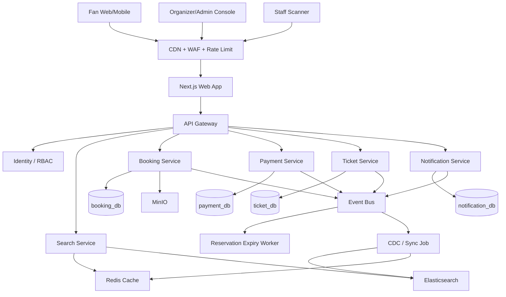

# Pulse Seat Technical Report

> Trạng thái: Draft để review  
> Tài liệu nguồn: [pulse-seat-system-design.md](pulse-seat-system-design.md)  
> Ngày tạo: 2026-05-24

## 1. Tóm Tắt Điều Hành

Pulse Seat là nền tảng đặt vé show ca nhạc theo hướng Ticketbox/Eventbrite/Ticketmaster. Phiên bản hiện tại tập trung vào journey chính: tìm show, xem detail/seat map, giữ vé tạm thời, thanh toán qua PSP, phát hành QR ticket và quét vé tại cổng.

Kiến trúc đề xuất là **simplified microservices**. Hệ thống tách các service theo bounded context, nhưng không chia nhỏ quá mức. Booking Service giữ consistency boundary quan trọng nhất cho availability, reservation và booking. Search/detail/read model được phép stale ngắn hạn; reserve/confirm luôn kiểm tra PostgreSQL trong transaction của Booking Service.

Stack MVP đề xuất:

- Frontend web: Next.js App Router + React cho Fan Web, Organizer/Admin Console và Staff Scanner web.
- Backend services/workers: Go.
- Source of truth: PostgreSQL.
- Cache/rate limit/session hint/hot availability summary: Redis.
- Full-text/faceted discovery: Elasticsearch/OpenSearch.
- Event backbone mặc định: Redpanda/Kafka-compatible event bus.
- Media/object storage: MinIO hoặc managed S3-compatible storage.
- Public API: REST/JSON.
- Internal API: REST mặc định cho MVP; riêng Booking Service -> Payment Service `CreatePaymentIntent` dùng gRPC ngay từ MVP.

Rủi ro kỹ thuật chính không phải average traffic, mà là **hot-event contention**: nhiều user cùng tranh một seat, section hoặc GA tier trong thời gian ngắn. Thiết kế xử lý bằng PostgreSQL row lock, TTL hold ngắn, idempotency key, active hold limit, rate limit, outbox/event-driven flow và UX xử lý conflict rõ ràng.

## 2. Scope Và Giả Định

### In Scope

- Fan tìm show theo city, date, artist, venue, genre, price, availability.
- Fan/Organizer/Staff dùng web app xây bằng Next.js, responsive và hỗ trợ SSR/CSR phù hợp từng flow.
- Fan xem event detail, ticket tier, venue, policy, media, seat map.
- General admission và reserved seating.
- Reservation TTL hold, không double sell.
- Checkout qua PSP adapter như Stripe/Adyen/PayOS/MoMo/ZaloPay.
- QR ticket issuance, void/refund state, duplicate scan detection.
- Organizer tạo event, performance, venue/seat map, tier, promo/access code và dashboard cơ bản.
- Staff check-in bằng QR scanner.
- Event-driven sync sang Elasticsearch, Redis và các read model nhẹ.

### Out Of Scope Cho MVP

- Virtual waiting room/admission token.
- Multi-region active-active.
- Resale marketplace, bidding, transfer phức tạp.
- Dynamic pricing ML.
- Tự xử lý card payment. Pulse Seat chỉ lưu PSP reference/token, không lưu PAN/CVV.
- Tối ưu cho onsale cực lớn cỡ Ticketmaster.

### Giả Định Scale

- Organizers: 1K.
- Venues: 2K.
- Active shows/year: 10K.
- Performances/show trung bình: 1.3.
- Capacity trung bình: 2K seats/tickets.
- Large show capacity: 20K-60K seats/tickets.
- DAU MVP: 100K.
- Read traffic lớn hơn write traffic, thường >100:1.
- Write traffic tập trung mạnh theo event/tier/seat trong onsale window.

## 3. Mục Tiêu Thiết Kế Hệ Thống

### Functional Goals

- Fan tìm show nhanh, filter/sort tốt.
- Fan chọn vé GA hoặc reserved seat.
- Hệ thống giữ vé tạm thời bằng reservation TTL trong checkout.
- Không bán trùng reserved seat; không bán vượt capacity GA bucket.
- Thanh toán qua PSP, xử lý webhook success/delay/failure/reversal an toàn.
- Chỉ phát hành ticket QR sau khi booking confirmed.
- Email/SMS confirmation chạy async, không rollback booking khi provider lỗi.
- Organizer có dashboard vận hành: sold, held, available, gross sales, refund, check-in count.
- Staff scan QR, phát hiện duplicate/void/refund ticket.

### Non-Functional Goals

| Nhóm | Mục tiêu |
|---|---|
| Correctness | Không có 2 ticket confirmed cho cùng một reserved seat; GA sold count không vượt capacity. |
| Consistency | Strong consistency cho reserve/confirm; eventual consistency cho search/detail/read model. |
| Search latency | p95 < 300 ms khi Redis cache hit; p95 < 500 ms khi query Elasticsearch. |
| Detail latency | p95 < 500 ms. |
| Reserve latency | p95 < 1 s trong điều kiện thường; có thể cao hơn khi hot-seat contention. |
| Availability | Search/detail vẫn hoạt động khi checkout degraded; checkout không confirm sai khi PSP/cache/search/notification lỗi. |
| Auditability | Append-only domain event/outbox cho reservation, booking, payment, ticket, notification. |
| Security | JWT/session, RBAC, signed QR token, PSP webhook signature, PII masking/encryption. |

## 4. Load, QPS, TPS Và Storage Sizing

### Inventory Sizing

```text
Active ticket inventory:
  10K shows/year * 1.3 performances/show * 2K average capacity
  ~= 26M sellable units/year
```

### QPS Estimate

| Traffic | Estimate | Ghi chú |
|---|---:|---|
| Average search QPS | ~6 QPS | 100K DAU * 5 searches/session / 86,400 seconds. |
| Campaign discovery peak | 500-2,000 QPS | Burst ngắn khi campaign/onsale. |
| Event detail read peak | Nên test 500-2,000 QPS | Thường tăng theo search. Cache TTL ngắn phải hấp thụ page hot. |
| Seat map/availability read | Nên test 200-1,000 QPS/event | Phụ thuộc UI polling/refresh. Tránh endpoint exact availability quá chatty. |
| Check-in scan peak | Target 50-100 QPS/event | Suy ra từ 20K-60K attendees vào cổng trong 60-90 phút với burst factor. |

### TPS Estimate

Trong report này, TPS là write transactions/second trên các path quan trọng.

| Write Path | MVP Target | Consistency Boundary |
|---|---:|---|
| Reservation attempts | 20-100 TPS/hot event | Booking Service PostgreSQL transaction. |
| Reserved seat hold | Bằng reservation attempts | Lock các row `seat_availability` được chọn. |
| GA hold | Bằng reservation attempts | Lock row `ga_availability_buckets`; split bucket nếu contention cao. |
| Booking confirm sau payment | Target burst 20-100 TPS | Booking Service transaction, idempotent payment event consumer. |
| Ticket issue | Target burst 20-100 TPS | Ticket Service transaction sau `booking.confirmed`. |
| Notification enqueue | 20-100 TPS enqueue | Async retry queue; provider send rate có thể thấp hơn. |
| Ticket scan write | Target 50-100 TPS/event | Ticket Service atomic `ACTIVE -> USED` hoặc row lock. |
| Event bus throughput | Target 500-1,000 msg/s ban đầu | 5x-10x headroom cho reservation/confirm/ticket/notification events. |

### Storage Estimate

| Data | Estimate |
|---|---:|
| Event/show metadata | < 10 GB cho MVP. |
| Seat availability rows | 26M rows/year * 100-200 bytes ~= 2.6-5.2 GB raw/year. |
| Bookings | 1M bookings/year * ~1 KB ~= 1 GB/year. |
| Tickets | 2M tickets/year * ~1 KB ~= 2 GB/year. |
| Audit/domain events | PostgreSQL xử lý được cho MVP; partition theo tháng nếu tăng nhanh. |
| Media | Lưu trong MinIO/object storage; PostgreSQL chỉ lưu metadata/object key. |

### Capacity Envelope Cho MVP

Production pilot nên load-test tối thiểu:

- 2,000 read QPS qua API Gateway/Search Service.
- 100 reservation TPS cho một hot event.
- 100 payment-confirm TPS burst qua outbox/event consumer.
- 100 ticket scan TPS cho event-day operations.
- 1,000 event messages/s qua event bus kèm retry/DLQ.
- PostgreSQL lock wait, deadlock và connection pool saturation khi hot-seat contention.

Nếu event thực tế vượt envelope này, MVP nên ưu tiên rate limit, graceful degradation và thông báo rõ cho user. Virtual queue/admission token là hướng scale sau, không phải yêu cầu của phase đầu.

## 5. Kiến Trúc Hệ Thống


Luồng tổng quan:



### Architecture Style

Pulse Seat dùng **simplified microservices + event-driven coordination**:

- Service boundaries đi theo bounded context, không đi theo từng CRUD table.
- Booking Service cố ý lớn hơn vì event/performance/seat map/tier/availability/reservation/booking cần gần nhau về transaction.
- Mỗi service sở hữu data và migration riêng.
- Cross-service state change dùng event và idempotent consumer.
- Search/dashboard dùng read model.

Thiết kế này tránh hai cực đoan:

- Monolith đơn giản nhưng khó scale riêng read-heavy discovery, ticket scan và notification.
- Microservices quá vụn dẫn tới distributed monolith và quá nhiều sync hop trong checkout.

### Frontend Architecture: Next.js

Pulse Seat dùng Next.js làm presentation layer chính cho web:

- **Fan Web**: discovery, event detail, seat map, checkout, ticket wallet.
- **Organizer/Admin Console**: event workspace, seat map builder, booking/attendee/report tables.
- **Staff Scanner Web**: check-in scanner, manual lookup, duplicate/void handling.

Route organization đề xuất:

```text
app/
  (public)/            landing, discovery, event detail
  (auth)/              login, callback, session recovery
  (fan)/               checkout, bookings, ticket wallet
  (organizer)/         dashboard, events, seat-map-builder, reports
  (staff)/             scanner, manual lookup
  api/                 thin BFF route handlers when server-side token/proxy is needed
```

Rendering/data strategy:

- Dùng App Router và React Server Components mặc định; chỉ đặt `'use client'` ở leaf components cần tương tác như seat map, checkout countdown, scanner camera, dashboard filters.
- Public discovery/event pages dùng SSR hoặc ISR ngắn qua `fetch(..., { next: { revalidate: 30-120 } })` tùy độ nóng của event.
- Seat map availability, reservation, checkout, payment polling và check-in scan dùng `cache: 'no-store'` hoặc client fetch explicit để tránh Next.js cache làm stale state nguy hiểm.
- Next.js không truy cập trực tiếp database/service private tables. FE chỉ gọi API Gateway REST hoặc gọi qua Next.js Route Handlers/Server Actions như một thin BFF.
- Route Handlers/Server Actions hữu ích cho authenticated mutations vì giữ refresh token/server secret ở server boundary; nhưng không được chứa business logic booking/payment.
- `loading.tsx`/`error.tsx` cần có cho các route async quan trọng: discovery, event detail, checkout, organizer dashboard, scanner.
- Content images dùng `next/image` với CDN/MinIO public URLs; object keys vẫn do Booking Service quản lý.

Caching guardrails:

- Next.js cache chỉ phục vụ UX/performance, không quyết định availability.
- `reserve`, `checkout`, `check-in`, `void/refund`, `payment status` không được cache.
- Nếu dùng tag-based revalidation, tag theo `event:{id}`, `performance:{id}`, `booking:{id}` và chỉ revalidate sau event/read-model update; không dùng thay thế cho Redis/Elasticsearch invalidation backend.

## 6. Service Boundaries Và Data Ownership

| Service/Job | Trách nhiệm | Data Ownership |
|---|---|---|
| Identity / RBAC | Login/session/JWT, organizer/staff roles, auth context. | users, sessions, roles, permissions. |
| Search Service | Full-text/faceted discovery, query cache, search suggestions. | Elasticsearch read model, Redis search cache keys, sync checkpoints. |
| Booking Service | Events, performances, venue, seat map, tier, availability, reservation TTL, booking aggregate, organizer dashboard source data. | events, performances, venues, seat maps, tiers, seat/GA availability, reservations, bookings, booking outbox. |
| Payment Service | Payment intent, PSP webhook, refund/reversal, reconciliation. | payment intents, payments, refunds, PSP references, payment outbox. |
| Ticket Service | QR issue, signed token validation, check-in scan, duplicate detection, void/refund ticket state. | tickets, ticket scans, QR token hashes, ticket outbox. |
| Notification Service | Email/SMS templates, send queue, retry, delivery log. | templates, notification jobs, delivery logs, notification outbox. |
| Reservation Expiry Worker | Expire `HELD` reservations, release seats/GA capacity. | Dùng Booking Service owned tables/code path; cần leader election hoặc partitioned workload. |
| CDC / Sync Job | Publish outbox events, update Elasticsearch, invalidate Redis, maintain read models và DLQ/retry state. | outbox checkpoints, DLQ/retry metadata. |

Rules:

- Service khác không query trực tiếp table của Booking Service.
- Cross-service reads đi qua API hoặc denormalized read model.
- PostgreSQL có thể dùng chung một managed cluster lúc đầu để giảm chi phí, nhưng schema/database và migrations phải tách theo service.
- Consumers phải track processed event IDs để idempotent.

## 7. Runtime Flows Quan Trọng

### Discovery Read Path

```text
Fan -> CDN/WAF -> API Gateway -> Search Service -> Redis -> Elasticsearch
```

Discovery được tối ưu cho read QPS và chấp nhận stale ngắn. Search result chỉ là tín hiệu discovery, không phải lời hứa availability chính xác. Reserve vẫn phải kiểm tra source of truth.

### Event Detail Và Seat Map Path

```text
Fan -> API Gateway -> Booking Service -> Redis/detail cache hoặc PostgreSQL
```

Event metadata và availability summary có thể cache TTL ngắn. Exact seat state vẫn phải revalidate trong reservation transaction.

### Reservation Path

```text
Fan -> API Gateway -> Booking Service -> PostgreSQL transaction
```

Reserved seating:

1. Check idempotency key.
2. Validate onsale window, access code, ticket limit, active hold limit.
3. `SELECT ... FOR UPDATE` trên các row `seat_availability` được chọn.
4. Insert `reservations` và `reservation_items`.
5. Update seats từ `AVAILABLE` sang `HELD`.
6. Insert domain event và outbox message trong cùng transaction.
7. Commit và trả `HELD` kèm `held_until`.

General admission:

1. Lock row `ga_availability_buckets`.
2. Check available count.
3. Tăng `held_count`.
4. Enforce `held_count + sold_count <= total_capacity`.
5. Commit reservation và outbox event.

### Checkout Và Confirm Path

```text
Booking Service --gRPC CreatePaymentIntent--> Payment Service -> PSP
PSP webhook -> Payment Service -> Event Bus -> Booking Service -> Ticket Service -> Notification Service
```

Booking Service gọi Payment Service bằng gRPC để tạo payment intent. Call này là sync internal command vì user đang chờ checkout response và contract giữa hai Go service cần typed schema rõ ràng. Nguyên tắc quan trọng: **không gọi Payment Service/PSP bên trong seat/GA lock transaction**. Booking Service chỉ gọi gRPC sau khi reservation/booking draft đã được commit hoặc đã ra khỏi vùng lock quan trọng.

gRPC `CreatePaymentIntent` phải có:

- deadline ngắn và rõ, ví dụ 1-2 giây cho Payment Service internal processing, không bao gồm thời gian PSP async dài.
- `idempotency_key`, `reservation_id`, `booking_id`, `amount`, `currency`, `buyer_ref`.
- `x-correlation-id` trong metadata.
- retry chỉ khi safe/idempotent; không retry mù với provider side effect.
- response hỗ trợ `payment_intent_id`, `provider`, `status`, `client_action`, `expires_at`.

Payment success flow:

1. Payment Service verify PSP webhook và lưu captured payment.
2. Payment Service publish `payment.captured`.
3. Booking Service consume `payment.captured`.
4. Booking Service lock reservation/booking rows.
5. Nếu reservation vẫn `HELD`, update reservation/booking sang `CONFIRMED`; seats sang `SOLD`; GA held count sang sold count.
6. Booking Service publish `booking.confirmed`.
7. Ticket Service issue QR tickets sau `booking.confirmed`.
8. Notification Service gửi email/SMS sau `ticket.issued` hoặc `booking.confirmed`.

Nếu PSP success đến sau khi reservation expired, Booking Service không confirm ticket. Payment Service tạo refund/reversal job.

### Check-In Path

```text
Staff Scanner -> API Gateway -> Ticket Service -> ticket_db
```

Ticket Service validate signed QR token, check ticket state và update atomic `ACTIVE -> USED`. Duplicate scan trả deterministic response chứa thông tin lần scan đầu, không tạo trạng thái mơ hồ.

## 8. Giao Tiếp Sync/Async, REST Và gRPC

### Protocol Split Đề Xuất

| Giao tiếp | Protocol | Lý do |
|---|---|---|
| Public client APIs | REST/JSON over HTTPS | Hợp browser/mobile, dễ debug, dễ cache/gateway, hỗ trợ OpenAPI tốt. |
| Browser/Next.js -> API Gateway | REST/JSON | Browser không gọi gRPC trực tiếp; REST dễ đi qua CDN/WAF, auth cookie/JWT và observability. |
| Next.js Route Handler/Server Action -> API Gateway | REST/JSON cho MVP | Next.js đóng vai thin BFF khi cần giữ token/server secret; không bypass API Gateway. |
| Gateway -> services | REST/JSON cho MVP; gRPC optional sau | REST đủ cho phần lớn flow MVP. gRPC chỉ dùng khi có contract internal rõ như Booking -> Payment. |
| Booking -> Payment create intent | gRPC sync | User đang chờ checkout response; hai service đều backend/internal; cần typed Protobuf contract, deadline, idempotency và metadata tracing. |
| PSP webhook -> Payment | HTTPS webhook | Chuẩn tích hợp của PSP. Cần verify signature và lưu raw webhook. |
| Payment -> Booking confirm | Async event | Tránh tight coupling và xử lý callback chậm an toàn. |
| Booking -> Ticket issue | Async event | Ticket issue là side effect sau booking confirmed; retryable và idempotent. |
| Ticket/Booking -> Notification | Async event | Notification lỗi không rollback booking. |
| CDC/Sync -> Search/Redis | Async event/stream | Read models converge eventually. |

### REST API Guidance

Public API dùng REST version `v1`:

- `GET /v1/events/search`
- `GET /v1/events/{event_id}`
- `GET /v1/performances/{performance_id}/seat-map`
- `POST /v1/reservations`
- `POST /v1/bookings`
- `GET /v1/tickets/{ticket_id}`
- `POST /v1/check-ins/scan`

Rules:

- Write endpoints bắt buộc có `Idempotency-Key`.
- Mọi request/event có `X-Correlation-Id`.
- Search/admin table dùng cursor-based pagination.
- Error response dùng stable error code: `TICKET_NOT_AVAILABLE`, `RESERVATION_EXPIRED`, `PAYMENT_PENDING`, `RATE_LIMITED`, `DUPLICATE_SCAN`.

### gRPC Guidance

MVP dùng gRPC bắt buộc cho luồng **Booking Service -> Payment Service `CreatePaymentIntent`**. Các luồng còn lại chỉ dùng gRPC khi:

- Contract là internal và đã ổn định.
- Strong typing/codegen giúp giảm lỗi integration.
- Low latency quan trọng và call không browser-facing.
- Call không tạo chuỗi sync dài.

MVP gRPC contract:

- `PaymentIntentService.CreateIntent`

Candidate gRPC contracts sau MVP:

- `BookingInternalService.GetReservation`
- `TicketInternalService.IssueTickets`
- `IdentityInternalService.IntrospectToken`

Không nên dùng gRPC để tạo chatty interfaces. Checkout chỉ nên có tối đa 1-2 sync hops.

### Nghiên Cứu Luồng Có Thể Dùng gRPC

Kết luận cập nhật: **MVP dùng gRPC cho Booking Service -> Payment Service `CreatePaymentIntent`**. Browser, Next.js client components và public web APIs vẫn dùng REST/JSON. Các flow xác nhận thanh toán, issue ticket, notification và read-model sync vẫn đi event bus vì chúng cần retry/idempotency/eventual consistency hơn là request/response sync.

| Flow | Có nên dùng gRPC? | Quyết định đề xuất | Lý do |
|---|---|---|---|
| Browser/Next.js client -> API Gateway | Không | REST/JSON | Public/browser-facing, cần CDN/WAF/debug/cache tooling; gRPC-Web không đáng thêm complexity cho MVP. |
| Next.js Server Component/Route Handler -> API Gateway | Không trong MVP | REST/JSON | Next.js là presentation/BFF layer, không nên bypass gateway. REST đủ và dễ vận hành trên serverless/self-hosted. |
| API Gateway -> Search Service | Chưa cần | REST/JSON | Search latency chủ yếu nằm ở Redis/Elasticsearch; REST dễ cache/debug. gRPC không giải quyết index/cache bottleneck. |
| API Gateway -> Booking Service reserve/checkout | Chưa nên | REST/JSON MVP | Reserve bị chi phối bởi PostgreSQL lock/transaction; gRPC không làm giảm hot-seat contention. Giữ API dễ debug khi conflict. |
| API Gateway -> Ticket Service scan | Có thể cân nhắc sau MVP | gRPC internal optional | Scan cần latency ổn định event-day và contract typed. Public scanner vẫn REST; gateway có thể gọi Ticket Service bằng gRPC sau khi ổn định. |
| Booking Service -> Payment Service create intent | Có | gRPC sync ngay MVP | Đây là sync internal command giữa hai backend service. Protobuf giúp khóa schema `amount/currency/idempotency/reservation/booking`, metadata tracing rõ, và tạo nền tốt cho nhiều PSP adapters. |
| Payment Service -> Booking Service confirm | Không | Async event | PSP webhook delay/duplicate cần idempotent event flow; sync gRPC sẽ tạo coupling không cần thiết. |
| Booking Service -> Ticket Service issue tickets | Không | Async event | Ticket issue là side effect sau `booking.confirmed`, cần retry/idempotency/DLQ. |
| Ticket/Booking -> Notification | Không | Async event | Notification không được block booking success. |
| Identity/RBAC introspection | Có thể cân nhắc | Local JWT validate trước; gRPC introspection optional | Gateway nên validate JWT locally. gRPC introspection chỉ cần khi dùng opaque token/session hoặc cần role check realtime. |
| CDC/Sync Job -> Search/Redis | Không | Event/stream + adapters | Đây là read-model sync, không phải request/response user-facing. |
| Organizer dashboard reads | Không trong MVP | REST/read model | Dashboard chịu eventual consistency; REST + cursor pagination đủ. |

Thứ tự gRPC contract hợp lý:

1. MVP: `PaymentIntentService.CreateIntent` cho Booking -> Payment.
2. Sau MVP: `TicketScanService.ValidateAndMarkUsed` cho gateway-to-ticket scan nội bộ nếu event-day traffic chứng minh cần latency/typing tốt hơn.
3. Sau MVP: `IdentityInternalService.IntrospectToken` chỉ khi không dùng local JWT validation hoặc cần policy decision realtime.

Không nên dùng gRPC cho:

- Browser/Next.js client calls.
- Async workflow đã cần event bus.
- Hot reservation path chỉ để “tối ưu protocol”, vì bottleneck thật nằm ở DB lock và fairness/rate limit.

### Async Event Design

Event envelope:

```json
{
  "eventId": "evt_uuid",
  "eventType": "booking.confirmed",
  "eventVersion": 1,
  "aggregateId": "booking_id",
  "correlationId": "request_uuid",
  "occurredAt": "2026-05-24T10:00:00+07:00",
  "payload": {}
}
```

Important events:

| Event | Producer | Consumers |
|---|---|---|
| `reservation.held` | Booking Service | Search/cache sync, dashboard read model. |
| `reservation.expired` | Expiry Worker/Booking Service | Search/cache sync, dashboard read model. |
| `payment.captured` | Payment Service | Booking Service. |
| `booking.confirmed` | Booking Service | Ticket Service, Notification Service, dashboard sync. |
| `booking.refund_required` | Booking Service | Payment Service. |
| `ticket.issued` | Ticket Service | Notification Service, dashboard sync. |
| `ticket.scan_accepted` | Ticket Service | Dashboard/analytics sync. |
| `notification.failed` | Notification Service | Retry/DLQ/ops alert. |

Transactional outbox là bắt buộc: service ghi business state và outbox message trong cùng local transaction, sau đó publisher/CDC job emit event ra broker.

## 9. Data, Cache Và Consistency Model

### PostgreSQL

PostgreSQL là source of truth cho transactional state vì hệ thống cần ACID để đảm bảo no-double-sell.

Use cases:

- Booking Service: event metadata, seat map, tiers, availability, reservations, bookings.
- Payment Service: payment intents, payment records, refunds, PSP references.
- Ticket Service: tickets, scan records, token hash, void/refund state.
- Notification Service: templates, send queue, delivery log.
- Identity/RBAC: users, sessions, roles.

Kỹ thuật chính:

- Row-level locks với `SELECT ... FOR UPDATE`.
- Check constraints cho GA capacity.
- Unique constraints cho seat/booking/ticket invariants.
- Idempotency tables cho write endpoints.
- Partition theo tháng sau này cho audit/outbox/scan tables nếu volume tăng.

### Redis

Redis xử lý dữ liệu ngắn hạn, không authoritative:

- Search query cache.
- Event detail cache.
- Availability summary cache.
- Rate limit counters.
- Session/TTL hints.
- Hot-event degraded fallback payloads.

Redis không được là source of truth cho reservation. Nếu Redis stale/down, reserve/confirm vẫn dựa vào PostgreSQL.

### Elasticsearch/OpenSearch

Elasticsearch/OpenSearch là discovery read model:

- Full-text search theo event title, artist, venue, city, genre, tags.
- Faceted filters theo date, city, genre, price, organizer, availability status.
- Sort theo date, popularity, price.
- Analyzer cho tiếng Việt/English artist và venue names.

Index có thể lag vài giây. Product phải xử lý `409 TICKET_NOT_AVAILABLE` bằng alternatives, không đẩy user về đầu flow.

### MinIO

MinIO lưu event/venue media:

- Event images, banners, venue maps, marketing assets.
- PostgreSQL lưu metadata, checksum, content type và object key.
- CDN serve public media paths.

### Consistency Boundaries

| Operation | Consistency Model |
|---|---|
| Search | Eventual consistency. |
| Event detail | Eventual consistency cho cached metadata/summary; exact state rechecked khi reserve. |
| Reserve | Strong consistency trong Booking Service PostgreSQL transaction. |
| Confirm booking | Strong consistency trong Booking Service transaction, trigger bởi idempotent payment event. |
| Ticket issue | Eventual sau booking confirmation; idempotent. |
| Notification | Eventual và retryable; không block booking success. |
| Dashboard analytics | Eventual consistency qua read model. |

## 10. Tech Stack Và Lý Do Lựa Chọn

| Layer | Công nghệ đề xuất | Vì sao chọn | Alternatives |
|---|---|---|---|
| Frontend web | Next.js App Router + React + TypeScript | SSR/ISR cho discovery/detail, RSC giúp giảm JS bundle, route groups phù hợp Fan/Organizer/Staff surfaces, dễ deploy Vercel hoặc standalone container. | Remix, Nuxt, SPA React/Vite. |
| Backend services | Go | Concurrency tốt, binary deploy đơn giản, phù hợp API/worker services, khớp context repo Golang. | Java/Kotlin Spring Boot, Node.js/NestJS. |
| API Gateway | Kong, Envoy, Nginx hoặc Traefik | Routing, TLS termination, rate limit, auth context propagation, correlation IDs. MVP có thể start đơn giản. | Cloud API Gateway, ALB only. |
| Public API | REST/JSON + OpenAPI | Hợp browser/mobile/admin, dễ test, dễ document. | GraphQL nếu frontend composition phức tạp, chưa cần cho MVP. |
| Internal API | REST mặc định; gRPC cho Booking -> Payment `CreatePaymentIntent` | Giữ public/gateway API đơn giản bằng REST, nhưng dùng Protobuf cho payment intent command cần schema chặt, deadline và idempotency rõ. | gRPC everywhere từ ngày đầu; REST-only internal. |
| Primary database | PostgreSQL | ACID, row locks, constraints, relational model, tooling mature; quan trọng cho no double sell. | MySQL, CockroachDB, DynamoDB conditional writes. |
| Cache | Redis | Low latency, TTL, rate limit counters, hot query cache, session hints. | Dragonfly, KeyDB, Memcached. |
| Search | Elasticsearch/OpenSearch | Full-text/faceted discovery, scoring, analyzer, tách read-heavy workload khỏi DB transactional. | PostgreSQL full-text cho MVP nhỏ hơn, Meilisearch nếu muốn ops đơn giản. |
| Event bus | Redpanda/Kafka-compatible default | Durable stream, consumer groups, partitioning, replay, hợp outbox/CDC/read model. | NATS JetStream cho ops cloud-native đơn giản hơn, RabbitMQ cho work-queue style jobs. |
| Object storage | MinIO | S3-compatible, local/dev dễ, portable sang managed S3-compatible storage. | AWS S3/GCS trực tiếp, local filesystem. |
| Observability | OpenTelemetry + Prometheus/Grafana + Sentry/managed APM | Trace/metric/log end-to-end, theo dõi lock wait, PSP latency, outbox lag. | Datadog/New Relic only. |
| Deployment | Docker Compose local; container production | Phù hợp microservice boundaries, chưa bắt buộc Kubernetes ngày đầu. | Kubernetes khi team/scale đủ lớn. |

### Vì Sao Chọn Next.js Cho FE?

- **SEO và discovery tốt hơn SPA thuần**: public event pages có thể SSR/ISR, hỗ trợ metadata/open graph cho campaign sharing.
- **Tách rendering theo workflow**: discovery/detail có thể cache ngắn; checkout/scan dùng dynamic no-store.
- **Giảm JS tải xuống**: Server Components giữ phần đọc dữ liệu ở server, chỉ client hóa phần tương tác cao như seat map/scanner.
- **BFF mỏng khi cần**: Route Handlers/Server Actions có thể giữ token/secret ở server boundary, proxy tới API Gateway, không chứa domain logic.
- **Deploy linh hoạt**: có thể chạy trên Vercel cho tốc độ delivery hoặc self-host bằng `output: standalone` để cùng platform với backend.

### Vì Sao Không Dùng Pure Monolith?

Monolith dễ ship hơn, nhưng Pulse Seat có các profile scale khác nhau:

- Search read-heavy, cần scale ngang độc lập.
- Booking write-critical, nhạy với DB contention.
- Ticket scan có burst theo event-day.
- Notification là side-effect retryable.

Service boundaries giúp scale/failure isolation tốt hơn, trong khi Booking Service vẫn giữ consistency boundary trung tâm.

### Vì Sao Không Tách Booking Thành Nhiều Service Ngay?

Event metadata, seat map, availability, reservation và booking có nhu cầu transaction gần nhau. Tách quá sớm sẽ kéo theo distributed transaction và chatty calls. Thiết kế hiện tại giữ chúng trong Booking Service, sau này có thể tách reporting, venue catalog hoặc organizer analytics khi traffic/team size đủ lớn.

## 11. Deployment Và Scaling Plan

### MVP Local

- Next.js web app chạy bằng `next dev`, gọi API Gateway local qua biến môi trường `NEXT_PUBLIC_API_BASE_URL` hoặc server-only `API_GATEWAY_URL`.
- Docker Compose cho PostgreSQL, Redis, Elasticsearch/OpenSearch, MinIO và event bus.
- Go services chạy như local processes hoặc containers.
- Shared contracts folder cho OpenAPI/protobuf/event schemas.
- Database migrations tách theo service.
- Baseline logging/tracing local.

### MVP Production


Recommended first production shape:

- 2 Next.js web replicas hoặc Vercel deployment cho Fan/Organizer/Staff web.
- 2 API Gateway replicas.
- 1-2 replicas cho Search, Booking, Payment, Ticket, Notification và Identity/RBAC.
- 1-2 Reservation Expiry Worker replicas với leader election hoặc partitioned workload.
- 1-2 CDC/Sync Job replicas với partitioned event consumption.
- Managed PostgreSQL cluster với database/schema riêng từng service và point-in-time recovery.
- Redis HA nếu budget cho phép.
- Small managed Elasticsearch/OpenSearch cluster.
- Redpanda/Kafka-compatible event bus cluster.
- MinIO distributed mode hoặc managed S3-compatible storage.
- CDN/WAF/rate limiting ở edge.
- OpenTelemetry traces, Prometheus/Grafana dashboards, Sentry hoặc managed APM.

### Component Scaling Strategy

| Component | Cách scale | Bottleneck cần theo dõi |
|---|---|---|
| Next.js Web App | Vercel/edge platform hoặc horizontal Node standalone replicas. | SSR latency, route handler saturation, cache config sai gây stale checkout/scan. |
| API Gateway | Horizontal replicas, edge rate limit. | Request bursts, auth/rate-limit overhead. |
| Search Service | Horizontal replicas, Redis cache, ES replicas. | ES query latency, cache hit rate, index lag. |
| Booking Service | Stateless replicas, DB pool tuning. | PostgreSQL row lock wait, hot GA bucket, connection pool saturation. |
| Payment Service | Horizontal replicas, idempotent webhook processing. | PSP latency/failure, webhook backlog. |
| Ticket Service | Horizontal replicas. | Scan write contention, duplicate scan logic, device retry storms. |
| Notification Service | Worker concurrency, provider rate limits. | Provider throttling, retry backlog, DLQ count. |
| Event Bus | Partition by aggregate/event/performance. | Consumer lag, broker disk, DLQ. |
| PostgreSQL | Managed HA, indexes, partitioning, read replicas cho non-critical reads. | Lock contention và write throughput. |
| Redis | HA, memory sizing, eviction policy. | Hot keys, stale cache, cache stampede. |
| Elasticsearch | Shards/replicas, mapping tuning. | Slow query, indexing lag, heap pressure. |

### Future Scale Upgrades

Chỉ thêm khi load test hoặc production traffic chứng minh cần:

- Virtual waiting room/admission token cho massive onsale.
- Per-event traffic shaping và queue fairness.
- Split hot GA capacity thành nhiều bucket theo section/channel để giảm lock contention.
- Dedicated read replicas/read models cho organizer analytics.
- Multi-region read-only discovery; write path vẫn single-primary cho tới khi có yêu cầu active-active rõ ràng.
- Service mesh khi team đã đủ operational maturity.

## 12. Resilience, Observability Và Security

### Resilience Patterns

- Timeout cho mọi outbound call.
- Retry with jitter chỉ cho call safe/idempotent.
- Circuit breaker quanh PSP, email/SMS provider, Elasticsearch và external dependencies.
- Không external network call trong Booking Service reserve/confirm DB transaction.
- DLQ cho failed event consumers.
- Grace period 15-30 giây trước khi expire hold để giảm refund do PSP latency.
- Stale cache fallback cho search/detail khi Elasticsearch degraded.
- Next.js routes có dynamic/cache config explicit; checkout/scan/payment status dùng no-store.

### Observability

Mọi request/event phải mang `X-Correlation-Id`.

Metrics bắt buộc:

- API request rate, latency, error rate theo route/service.
- Search latency, cache hit rate, Elasticsearch error rate.
- Reservation success/conflict/timeout rate.
- PostgreSQL lock wait time theo performance/tier/section.
- Hold-to-confirm ratio.
- PSP success/failure/webhook latency.
- Ticket issue latency.
- Scan accepted/rejected/duplicate count.
- Outbox backlog, CDC lag, event bus consumer lag, DLQ count.

Traces bắt buộc:

- Search request.
- Reserve transaction.
- Checkout/payment intent.
- PSP webhook -> booking confirm -> ticket issue -> notification.
- Check-in scan.

### Security

- TLS ở edge và internal service communication nếu có thể.
- JWT/session auth với short-lived access token và refresh token.
- RBAC roles: `FAN`, `ORGANIZER_OWNER`, `ORGANIZER_STAFF`, `CHECK_IN_STAFF`, `ADMIN`.
- Organizer/staff permissions scoped by organizer/event/performance.
- Signed QR token với key ID, nonce, issued-at/expiry và DB-stored token hash.
- PSP webhook signature verification.
- Không lưu card PAN/CVV.
- Encrypt hoặc mask buyer/attendee PII.
- Redact PII và QR token khỏi logs.
- Audit admin actions cho price, tier, seat map, refund, void, cancellation.

## 13. Key Technical Decisions

| Decision | Rationale | Trade-off |
|---|---|---|
| Simplified microservices | Scale/failure isolation tốt hơn monolith nhưng vẫn tránh chia quá vụn. | Ops phức tạp hơn monolith. |
| Booking Service sở hữu availability/reservation/booking | Giữ no-double-sell invariant trong một transaction boundary. | Booking Service lớn, cần module nội bộ rõ. |
| PostgreSQL làm source of truth | ACID, row lock, constraints, auditability. | Hot event có thể lock contention. |
| Pessimistic locking cho reservation | Giảm retry storm và giữ correctness đơn giản khi tranh seat. | User có thể chờ hoặc nhận conflict khi demand cao. |
| Elasticsearch cho discovery | Full-text/faceted search tốt, tách workload khỏi transactional DB. | Index eventual consistency và mapping/versioning. |
| Redis cho cache/rate limit | TTL/counter/cache nhanh. | Không được coi Redis là source of truth. |
| Transactional outbox | Tránh mất event sau khi DB commit. | Cần publisher, retry, DLQ, lag monitoring. |
| Async ticket/notification | Booking success không phụ thuộc side effects. | User có thể chờ ngắn để ticket/notification xuất hiện. |
| Booking -> Payment dùng gRPC | Payment intent là sync internal command, cần typed contract và deadline rõ. | Cần vận hành protobuf/codegen, gRPC health check, deadline/retry/circuit breaker. |

## 14. Risk Register

| Risk | Impact | Mitigation |
|---|---|---|
| Next.js cache sai cho availability/checkout | User thấy trạng thái cũ hoặc checkout/scan bị sai UX. | `cache: 'no-store'` cho reserve/checkout/scan/payment, cache ngắn chỉ cho discovery/detail, review route config. |
| Hot-seat lock contention | Reserve chậm, timeout, UX xấu. | Short TTL, active hold limit, conflict UX, lock wait dashboard, split GA bucket nếu cần. |
| Search/detail cache stale | User thấy vé còn dù đã hết. | Reserve recheck PostgreSQL, trả `409` kèm alternatives, TTL ngắn và targeted invalidation. |
| PSP webhook delay/duplicate | Payment state lệch booking state. | Idempotent webhook, raw webhook store, event-driven confirm, refund/reversal job cho late success. |
| gRPC Booking -> Payment timeout | Checkout trả lỗi/`PAYMENT_PENDING` không nhất quán nếu xử lý sai. | Deadline 1-2 giây, idempotency key, circuit breaker, không retry non-idempotent, reconciliation job. |
| Event bus/CDC lag | Search/dashboard/cache stale quá lâu. | Monitor lag, scale consumers, DLQ, replay từ outbox. |
| Notification provider down | Buyer chưa nhận email/SMS. | Async retry, DLQ, ticket wallet trong app vẫn là source cho user. |
| QR replay/duplicate scan | Fraud hoặc nhầm cổng. | Signed token, token hash, atomic `ACTIVE -> USED`, duplicate response có first scan info. |
| Direct DB coupling giữa services | Distributed monolith, migration nguy hiểm. | Enforce API/read-model-only access; schema/migration ownership rõ. |
| Over-engineering quá sớm | Chậm delivery, tăng chi phí ops. | Giữ MVP stack nhỏ; defer virtual queue, service mesh, active-active, split service sâu. |

## 15. Load Test Plan

Trước production pilot nên test:

1. Next.js SSR/ISR: discovery/detail ở 500-2,000 QPS, đo TTFB, cache hit và API Gateway load.
2. Search campaign: 500, 1,000 và 2,000 QPS với mixed cache hit/miss.
3. Seat reserve contention: 100 users/s tranh cùng section và tranh cùng hot seats.
4. GA bucket contention: 100 reserve attempts/s vào cùng tier bucket.
5. Checkout webhook burst: 100 `payment.captured` events/s, có duplicate và delayed events.
6. Expiry race: payment captured quanh `held_until` + grace period 15-30 giây.
7. Ticket scan: 100 scans/s gồm accepted, duplicate, void, invalid token.
8. Event bus failure: broker pause/restart, consumer replay, DLQ handling.
9. Elasticsearch lag/down: Search Service fallback và cache behavior.
10. Redis down/eviction: Booking correctness không bị ảnh hưởng, search/detail degrade có kiểm soát.
11. gRPC `PaymentIntentService.CreateIntent`: test deadline, retry/idempotency, circuit breaker, Payment Service unavailable và duplicate idempotency key.
12. gRPC candidate benchmark sau MVP: so sánh REST vs gRPC cho `TicketScanService` nếu scan throughput vượt envelope.

## 16. Open Review Questions

- Chọn event bus nào cho implementation đầu tiên: Redpanda/Kafka-compatible, NATS JetStream hay RabbitMQ?
- Checkout conversion rate thực tế trong hot event là bao nhiêu? Con số này ảnh hưởng confirm/ticket/notification TPS.
- SLA mục tiêu cho MVP production là 99.5%, 99.9% hay cao hơn?
- Cloud/provider và monthly infrastructure budget dự kiến là gì?
- Next.js production nên chạy Vercel hay self-host standalone container cùng backend platform?
- Identity/RBAC nên là service riêng từ ngày đầu hay bắt đầu trong API Gateway/Booking context rồi tách sau?
- Protobuf contract cho `PaymentIntentService.CreateIntent` cần field tối thiểu nào và deadline mặc định bao nhiêu?
- Peak traffic threshold nào sẽ kích hoạt virtual waiting room/admission token?
- Offline check-in có bắt buộc ở event-day release đầu tiên không?
- Có compliance requirement nào ngoài việc không lưu PAN/CVV không, ví dụ SOC 2, ISO 27001 hoặc data residency?

## 17. Review Summary

Kiến trúc hiện tại đủ mạnh cho MVP và moderate hot events nếu team validate contention paths sớm. Thứ tự ưu tiên implementation nên là:

1. Correctness của Booking Service transaction.
2. Idempotency trên toàn bộ write paths.
3. Transactional outbox và idempotent consumers.
4. gRPC `PaymentIntentService.CreateIntent` với deadline, metadata tracing, retry/idempotency và circuit breaker.
5. Next.js cache/rendering config đúng cho từng route, đặc biệt no-store cho checkout/scan/payment.
6. UX cho eventual consistency của search/cache.
7. Observability quanh lock wait, reservation conflict, PSP latency và event lag.
8. Load test tập trung vào hot-event behavior, không chỉ average QPS.
