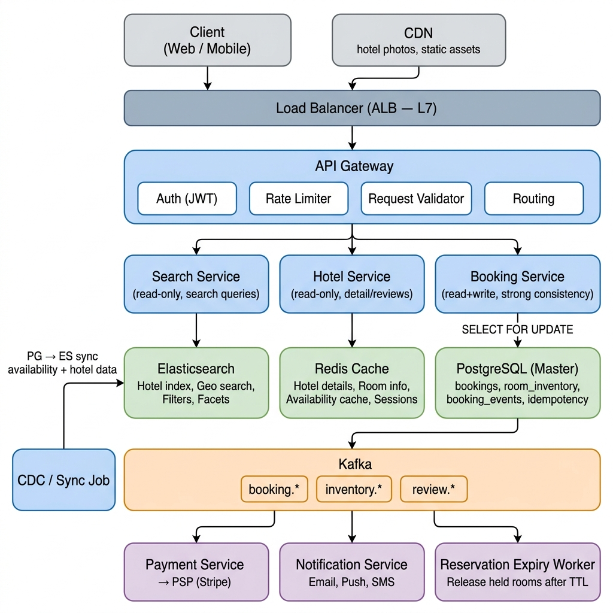
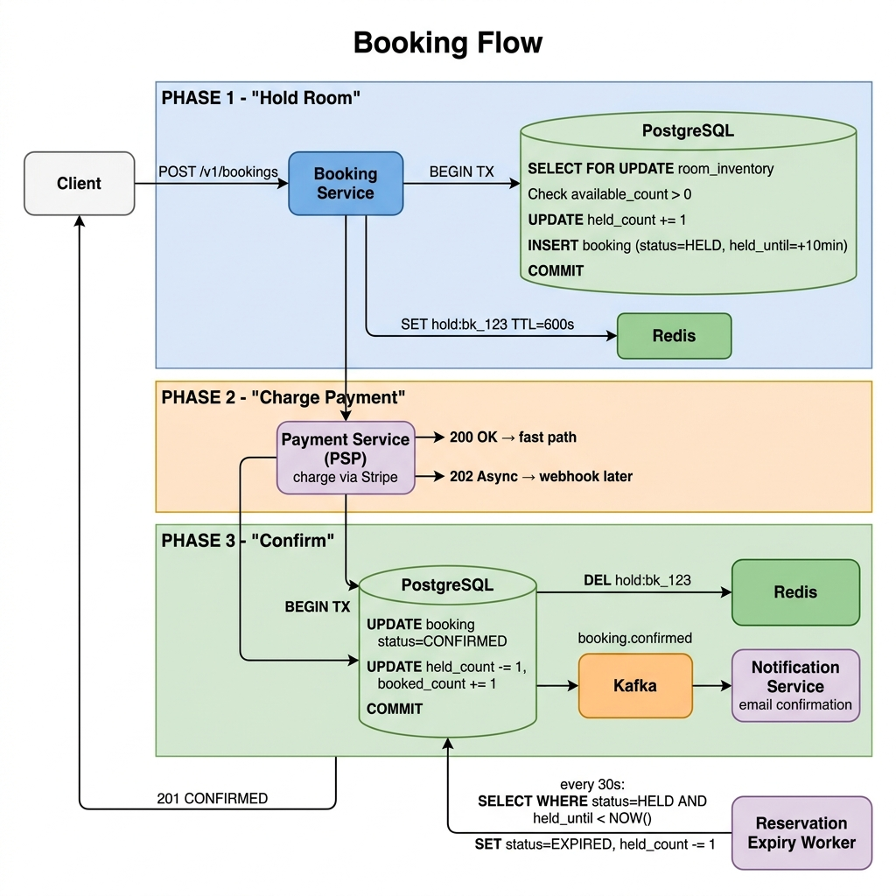
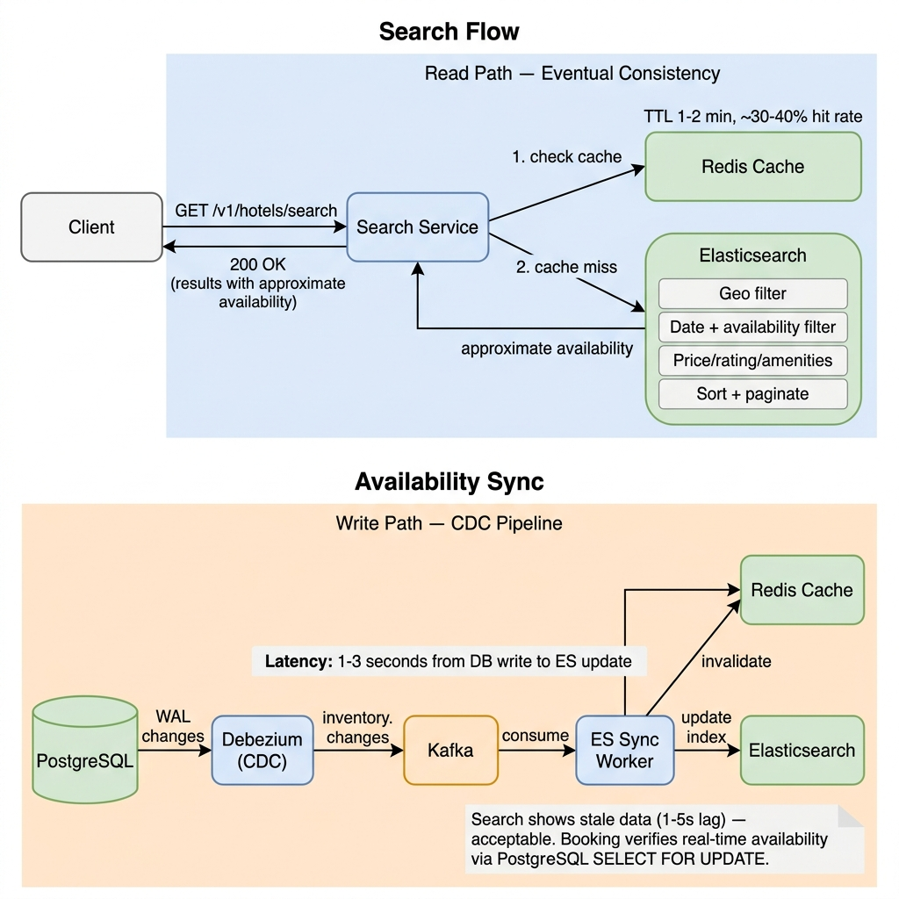
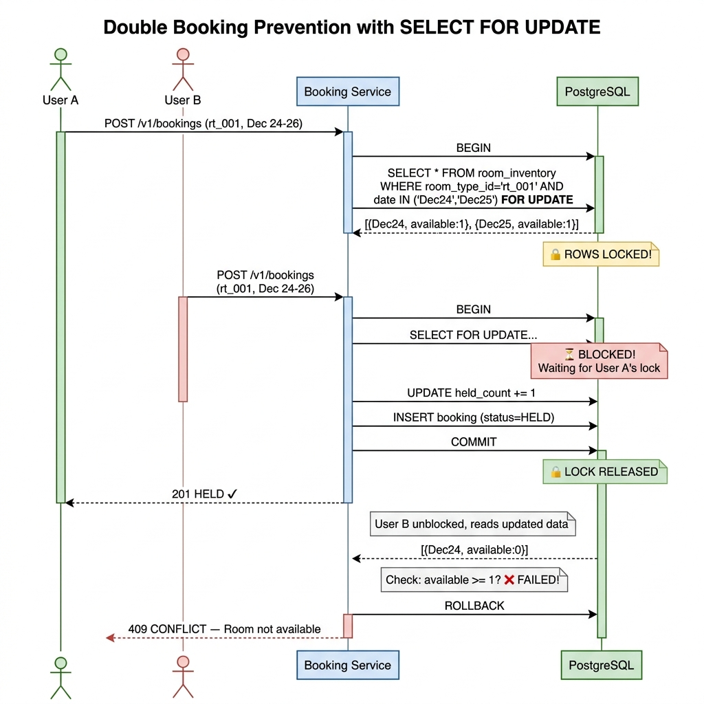
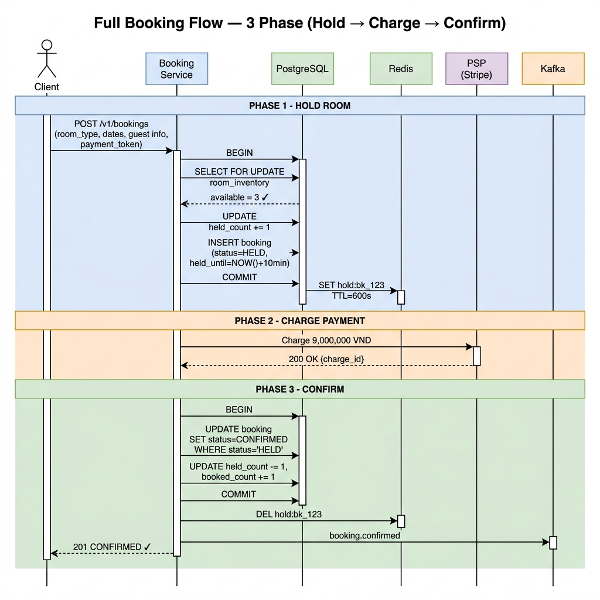
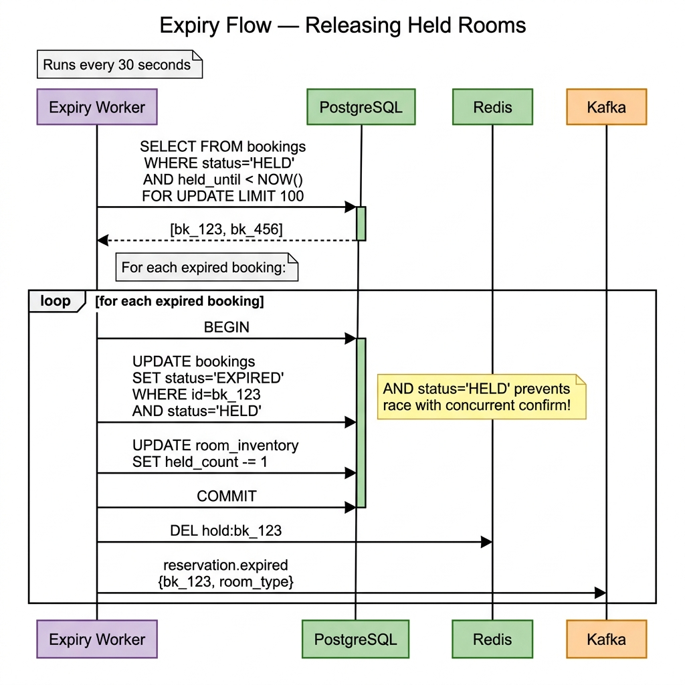
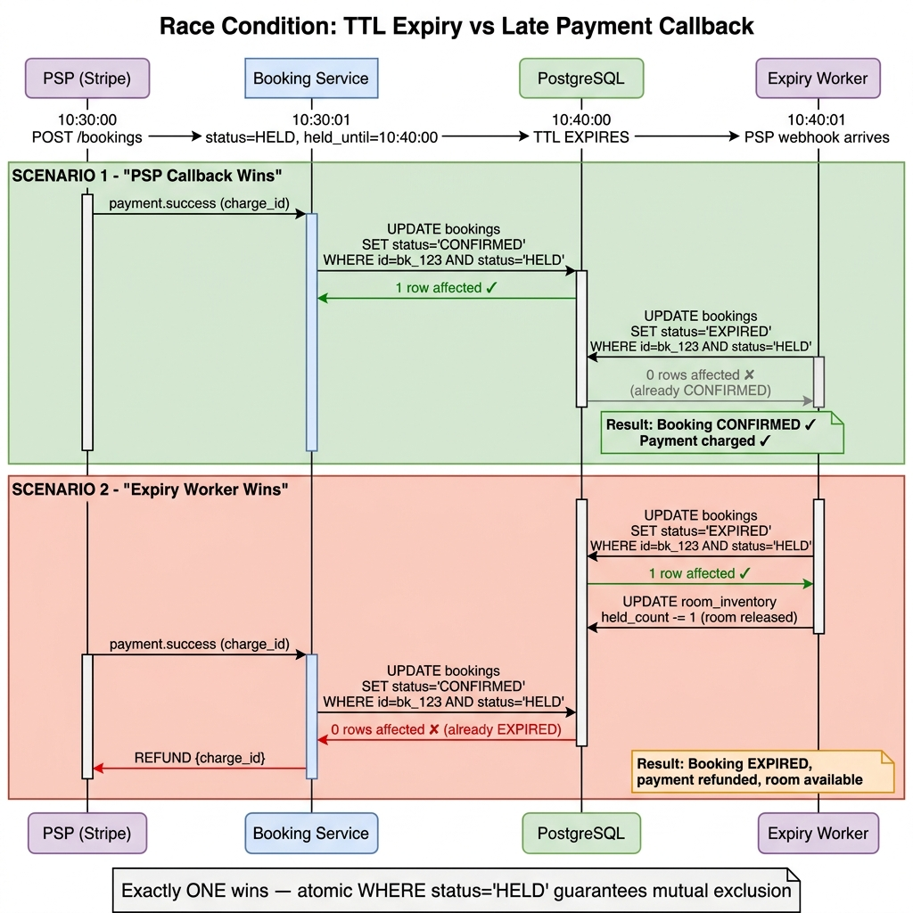

# Design a Hotel Booking Platform (Booking.com / Airbnb / Agoda)

> Design a hotel booking platform where users can search for hotels,
> view room availability, and book rooms. No double booking allowed.
> System must handle flash sales with 10M concurrent users searching.

---

# 1. Clarify Requirements: 5 min

## Functional Requirements
- **View hotels/rooms**: Hotel details — name, photos, amenities, reviews, room types (single, double, suite), nightly pricing
- **Search hotels**: By location, check-in/check-out dates, guests, price range, rating, amenities. Returns list of hotels with available rooms
- **Book rooms**: Select room → enter guest info → submit booking (system internally holds room, charges payment, confirms). No double booking — one room, one person, one date range. If payment takes time, the room is held for 10 minutes via a TTL reservation
- **Cancel booking**: Refund based on cancellation policy (free cancel before deadline, partial/no refund after)
- **Reviews**: Users can leave reviews after checkout
- **Pricing**: Dynamic pricing per date (weekday vs weekend, peak season, demand-based)

## Non-Functional Requirements
- **Availability**: Search & view must be highly available. Even if booking service is down, users can still browse
- **Consistency**: Booking must be strongly consistent. Absolutely no double booking. 1000 concurrent clicks on same room → only 1 succeeds
- **Scalability**: 10M concurrent users during flash sales / holiday seasons (Christmas, New Year, Tet)
- **Search latency**: p99 < 500ms. Search must feel instant
- **Read:Write ratio**: 100:1. Extremely read-heavy — most users search & browse, very few actually book
- **Durability**: Zero data loss on bookings. Every booking must have audit trail

## Key Clarifying Questions (asked to interviewer)
1. Do we support multiple rooms per booking, or one room per booking?
   → **One room per booking** for simplicity. Multiple rooms = multiple bookings.
2. Do we need a "temporary hold" when user starts checkout?
   → **Yes**: 10-minute hold (TTL reservation) to prevent race during payment.
3. Do we handle payment ourselves or use a PSP?
   → **PSP** (Stripe/Adyen) for payment processing. We manage the booking flow.
4. How many hotels and rooms in the system?
   → **500K hotels, 5M rooms** globally. Similar to Booking.com scale.
5. Do we need instant confirmation or host-approval model?
   → **Instant confirmation** (like Booking.com). No host approval step.

---

# 2. Back-of-the-Envelope Estimation: 5 min

## Users & Traffic
    Total users:         200M registered
    DAU:                 20M (10%)
    Total hotels:        500K
    Total rooms:         5M (avg 10 rooms/hotel)
    Total listings:      5M rooms × 365 days = ~1.8B availability slots/year

## QPS Calculations
    Search QPS:
        Each user searches ~10 times/session
        = 20M × 10 / 86,400 ≈ ~2,300 QPS avg
        Peak (flash sale / holiday, 10M concurrent):
        = 10M × 10 / 3,600 (concentrated in 1h) ≈ ~28,000 QPS peak
        Round up to ~30,000 QPS peak search

    View hotel detail QPS:
        Each user views ~5 hotel pages per session
        = 20M × 5 / 86,400 ≈ ~1,150 QPS avg
        Peak ≈ ~15,000 QPS

    Booking (write) QPS:
        Conversion rate ~1% of searchers actually book
        = 20M × 0.01 / 86,400 ≈ ~2.3 QPS avg
        Peak ≈ ~50 QPS (even during flash sale, actual bookings are low)

    Read:Write ratio = (2,300 + 1,150) / 2.3 ≈ ~1,500:1 (extremely read-heavy)

    Total read QPS peak: ~45,000 QPS
    Total write QPS peak: ~50 QPS

## Record Sizes
    Hotel record:
        - hotel_id, name, description, location, lat/lng,
          star_rating, amenities (JSON), photos (URLs), policies...
        ≈ ~5 KB/record
        Total: 500K × 5KB = ~2.5 GB (fits in memory!)

    Room type record:
        - room_type_id, hotel_id, name, description, max_guests,
          bed_type, amenities, photos, base_price...
        ≈ ~2 KB/record
        Total: 5M × 2KB = ~10 GB

    Availability record (per room per date):
        - room_id, date, is_available, price, booking_id
        ≈ ~30 bytes/record
        Active window (next 365 days): 5M × 365 × 30B = ~55 GB
        → Fits on a single PG instance with good indexing

    Booking record:
        - booking_id, user_id, hotel_id, room_id, check_in, check_out,
          guests, total_price, status, payment_ref, timestamps...
        ≈ ~500 bytes/record

    Daily bookings: 20M × 0.01 = 200K bookings/day
    Daily booking storage: 200K × 500B = ~100 MB/day
    Yearly: ~36 GB/year → very manageable

    Review record: ~500 bytes/record
    Photos: stored in S3/CDN, DB stores URLs only

## Infrastructure Sizing
    Elasticsearch (search):
        - 500K hotels × 5KB = ~2.5 GB index (tiny for ES)
        - 30,000 QPS peak → need ~10-15 ES nodes (each handles ~3K QPS)
        - Replicas: 2 replicas per shard for read throughput

    PostgreSQL (booking, source of truth):
        - 50 QPS peak write → single master handles easily
        - Read replicas (2x) for hotel detail reads
        - Availability table: 55 GB → fits on single instance

    Redis:
        - Hotel cache: 2.5 GB
        - Availability cache: popular hotels only, ~5 GB
        - Session/TTL reservations: ~1 GB
        - Total: ~8-10 GB → single Redis cluster

---

# 3. API Design: 5 min

Authentication: JWT token for users. API key for partner integrations.
Style: REST with JSON. Versioned: /v1/
Rate limiting: 50 search req/s per user (prevent scraping), 5 booking req/s per user.

## 3.1 Search Hotels (read-heavy, need cache + Elasticsearch)
    ──────────────────────────────────────────────────────────
    GET /v1/hotels/search
        ?location=hanoi
        &check_in=2026-12-24
        &check_out=2026-12-26
        &guests=2
        &min_price=500000
        &max_price=3000000
        &star_rating=4
        &amenities=wifi,pool,parking
        &sort=rating            ← rating | price_asc | price_desc | distance
        &cursor=eyJpZCI6MTAwfQ==
        &limit=20

    Response: 200 OK
    {
        "data": [
            {
                "hotel_id": "htl_001",
                "name": "Sofitel Legend Metropole Hanoi",
                "star_rating": 5,
                "location": { "lat": 21.0252, "lng": 105.8572, "district": "Hoan Kiem" },
                "thumbnail_url": "https://cdn.example.com/htl_001/thumb.jpg",
                "review_score": 9.2,
                "review_count": 3420,
                "cheapest_room": {
                    "room_type": "Premium Room",
                    "price_per_night": 4500000,
                    "original_price": 6000000,         ← strikethrough price
                    "currency": "VND"
                },
                "available_rooms": 3,                  ← approximate (eventual consistent)
                "amenities": ["wifi", "pool", "spa", "breakfast"],
                "tags": ["Free cancellation", "Pay at property"]
            },
            ...
        ],
        "next_cursor": "eyJpZCI6MTIwfQ==",
        "has_more": true,
        "total_count": 156                             ← approximate count
    }

## 3.2 Get Hotel Detail
    ──────────────────────────────────────────────────────────
    GET /v1/hotels/{hotel_id}?check_in=2026-12-24&check_out=2026-12-26&guests=2

    Response: 200 OK
    {
        "hotel_id": "htl_001",
        "name": "Sofitel Legend Metropole Hanoi",
        "description": "Historic luxury hotel in the heart of Hanoi...",
        "star_rating": 5,
        "location": {
            "address": "15 Ngo Quyen, Hoan Kiem, Hanoi",
            "lat": 21.0252, "lng": 105.8572
        },
        "photos": ["url1", "url2", "url3"],
        "amenities": ["wifi", "pool", "spa", "gym", "restaurant", "bar"],
        "policies": {
            "check_in_time": "14:00",
            "check_out_time": "12:00",
            "cancellation": "Free cancellation before 48h"
        },
        "rooms": [
            {
                "room_type_id": "rt_001",
                "name": "Premium Room",
                "description": "...",
                "max_guests": 2,
                "bed_type": "King",
                "size_sqm": 32,
                "amenities": ["minibar", "bathtub", "city_view"],
                "photos": ["url1", "url2"],
                "price_per_night": 4500000,
                "total_price": 9000000,                ← for 2 nights
                "currency": "VND",
                "available_count": 3,                  ← real-time from PostgreSQL
                "cancellation_deadline": "2026-12-22T14:00:00Z"
            },
            {
                "room_type_id": "rt_002",
                "name": "Grand Suite",
                "price_per_night": 12000000,
                "available_count": 1,
                ...
            }
        ],
        "reviews_summary": {
            "score": 9.2,
            "count": 3420,
            "breakdown": { "cleanliness": 9.4, "location": 9.8, "service": 9.0, "value": 8.6 }
        }
    }

## 3.3 Create Booking (Critical — need idempotency + locking)
    ──────────────────────────────────────────────────────────
    POST /v1/bookings
    Headers:
        Authorization: Bearer <jwt_token>
        Idempotency-Key: "idem_booking_uuid_789"

    Request:
    {
        "hotel_id": "htl_001",
        "room_type_id": "rt_001",
        "check_in": "2026-12-24",
        "check_out": "2026-12-26",
        "guests": 2,
        "guest_name": "Nguyen Van A",
        "guest_email": "a@example.com",
        "guest_phone": "+84912345678",
        "special_requests": "High floor, quiet room",
        "payment_method_token": "tok_visa_4242"
    }

    Internal flow (single API, no separate reserve/confirm):
    ┌──────────────────────────────────────────────────────┐
    │ 1. Check idempotency key                             │
    │ 2. BEGIN TX                                          │
    │ 3. SELECT FOR UPDATE on room_inventory rows         │
    │ 4. Check available_count > 0 for ALL dates           │
    │ 5. UPDATE held_count += 1 (temporary hold)           │
    │ 6. INSERT booking (status=HELD, held_until=+10min)   │
    │ 7. COMMIT                                            │
    │                                                      │
    │ 8. Call PSP → charge payment (async, up to 10min)    │
    │                                                      │
    │ 9. On PSP success:                                   │
    │    BEGIN TX                                          │
    │    UPDATE booking status=CONFIRMED                   │
    │    UPDATE held_count -= 1, booked_count += 1         │
    │    COMMIT                                            │
    │                                                      │
    │ 10. On PSP failure or timeout after 10min:           │
    │     Release hold → status=EXPIRED                    │
    └──────────────────────────────────────────────────────┘

    Response (success): 201 Created
    {
        "id": "bk_2xK9mN4vB7qR",
        "status": "CONFIRMED",
        "hotel": { "id": "htl_001", "name": "Sofitel Legend Metropole Hanoi" },
        "room_type": "Premium Room",
        "room_number": "1205",                         ← assigned room
        "check_in": "2026-12-24",
        "check_out": "2026-12-26",
        "nights": 2,
        "total_price": 9000000,
        "currency": "VND",
        "payment_status": "CHARGED",
        "cancellation_deadline": "2026-12-22T14:00:00Z",
        "confirmation_code": "BK-A7X9M2",
        "created_at": "2026-04-25T10:30:00Z"
    }

    Response (PSP slow, hold created — polling/webhook will confirm):
    202 Accepted
    {
        "id": "bk_2xK9mN4vB7qR",
        "status": "HELD",
        "held_until": "2026-04-25T10:40:00Z",         ← 10-min TTL
        "message": "Payment is processing. You will receive confirmation shortly.",
        "poll_url": "/v1/bookings/bk_2xK9mN4vB7qR"   ← client polls for status
    }

    Error case (room no longer available):
    Response: 409 Conflict
    {
        "error": "ROOM_NOT_AVAILABLE",
        "message": "Sorry, this room type is no longer available for the selected dates.",
        "suggestions": [                               ← help user find alternatives
            { "room_type_id": "rt_002", "name": "Grand Suite", "price": 12000000 }
        ]
    }

## 3.4 Cancel Booking
    ──────────────────────────────────────────────────────────
    POST /v1/bookings/{booking_id}/cancel

    Request:
    {
        "reason": "CHANGE_OF_PLANS"
    }

    Response: 200 OK
    {
        "id": "bk_2xK9mN4vB7qR",
        "status": "CANCELLED",
        "refund_amount": 9000000,                      ← full refund (before deadline)
        "refund_status": "PENDING",
        "cancelled_at": "2026-04-25T12:00:00Z"
    }

## 3.5 Check Availability (internal or hotelier dashboard)
    ──────────────────────────────────────────────────────────
    GET /v1/hotels/{hotel_id}/rooms/{room_type_id}/availability
        ?start=2026-12-01&end=2026-12-31

    Response: 200 OK
    {
        "room_type_id": "rt_001",
        "total_rooms": 10,                             ← 10 physical rooms of this type
        "availability": {
            "2026-12-24": { "available": 3, "price": 4500000, "min_stay": 2 },
            "2026-12-25": { "available": 3, "price": 5000000, "min_stay": 2 },
            "2026-12-26": { "available": 8, "price": 3000000, "min_stay": 1 },
            ...
        }
    }

## Booking Status State Machine
    ┌───────────────────────────────────────────────────────────────┐
    │                                                               │
    │  HELD ──────────▶ CONFIRMED ──────────▶ COMPLETED             │
    │   │  (payment OK)     │                  (after checkout)     │
    │   │                   │                                       │
    │   ▼                   ▼                                       │
    │  EXPIRED           CANCELLED                                  │
    │  (TTL timeout)     (user/policy)                              │
    │                       │                                       │
    │                       ▼                                       │
    │                   REFUNDED                                    │
    │                                                               │
    └───────────────────────────────────────────────────────────────┘

    Valid transitions:
    ├── HELD → CONFIRMED (payment succeeds within TTL)
    ├── HELD → EXPIRED (10-min TTL exceeded, no payment)
    ├── CONFIRMED → CANCELLED (user cancels before deadline)
    ├── CONFIRMED → COMPLETED (after check-out date)
    ├── CANCELLED → REFUNDED (refund processed)
    └── EXPIRED → (room released back to inventory automatically)

---

# 4. DB Model Design: 5 min

Database: **PostgreSQL** — strong consistency for bookings, ACID transactions for double-booking prevention.
PK strategy: BIGINT auto-increment. Store monetary amounts as BIGINT in smallest currency unit.
Availability model: **Inventory-count approach** — track available_count per room_type per date (not per individual physical room).

## 4.1 Hotels
    hotels
    ├── id                  BIGINT PK AUTO_INCREMENT
    ├── external_id         VARCHAR(32) UNIQUE              ← "htl_001"
    ├── name                VARCHAR(200) NOT NULL
    ├── description         TEXT
    ├── address             VARCHAR(500)
    ├── city                VARCHAR(100)
    ├── country             CHAR(2)                         ← ISO 3166
    ├── latitude            DECIMAL(10,8)                   ← geo search
    ├── longitude           DECIMAL(11,8)
    ├── star_rating         SMALLINT CHECK (1-5)
    ├── review_score        DECIMAL(2,1)                    ← 9.2, denormalized
    ├── review_count        INT DEFAULT 0                   ← denormalized
    ├── amenities           JSONB                           ← ["wifi","pool","spa"]
    ├── photos              JSONB                           ← ["cdn_url1","cdn_url2"]
    ├── policies            JSONB                           ← check-in/out times, cancellation
    ├── status              ENUM('ACTIVE','INACTIVE','DELETED')
    ├── created_at          TIMESTAMP
    └── updated_at          TIMESTAMP
    INDEX: (city, status)
    INDEX: (latitude, longitude)                            ← geo queries (or PostGIS)
    INDEX: (star_rating)
    -- Sync to Elasticsearch for full-text + geo + faceted search

## 4.2 Room Types (each hotel has N room types, each type has M physical rooms)
    room_types
    ├── id                  BIGINT PK
    ├── external_id         VARCHAR(32) UNIQUE              ← "rt_001"
    ├── hotel_id            BIGINT FK → hotels.id
    ├── name                VARCHAR(100)                    ← "Premium Room"
    ├── description         TEXT
    ├── max_guests          SMALLINT
    ├── bed_type            VARCHAR(50)                     ← "King", "Twin", "Double"
    ├── size_sqm            SMALLINT
    ├── total_rooms         SMALLINT NOT NULL                ← 10 physical rooms of this type
    ├── base_price          BIGINT                          ← default price per night (cents)
    ├── amenities           JSONB                           ← ["minibar","bathtub","city_view"]
    ├── photos              JSONB
    ├── created_at          TIMESTAMP
    └── updated_at          TIMESTAMP
    INDEX: (hotel_id)

## 4.3 Room Inventory / Availability (core table — double booking prevention)
    room_inventory
    ├── id                  BIGINT PK
    ├── hotel_id            BIGINT FK → hotels.id           ← denormalized for query speed
    ├── room_type_id        BIGINT FK → room_types.id
    ├── date                DATE NOT NULL
    ├── total_rooms         SMALLINT NOT NULL                ← total physical rooms
    ├── booked_count        SMALLINT NOT NULL DEFAULT 0     ← how many are booked
    ├── held_count          SMALLINT NOT NULL DEFAULT 0     ← temporary holds (TTL reservations)
    ├── available_count     SMALLINT GENERATED ALWAYS AS    ← computed column
    │                       (total_rooms - booked_count - held_count) STORED
    ├── price               BIGINT NOT NULL                 ← dynamic price for this date (cents)
    ├── min_stay            SMALLINT DEFAULT 1
    ├── updated_at          TIMESTAMP
    └── CONSTRAINT available_check CHECK (booked_count + held_count <= total_rooms)
    PRIMARY KEY: (room_type_id, date)                       ← composite PK, natural partition
    INDEX: (hotel_id, date, available_count)                 ← search: "hotels with rooms on X date"
    INDEX: (date, room_type_id)                              ← settlement/batch queries
    -- SELECT FOR UPDATE on this row to prevent double booking
    -- CHECK constraint as DB-level safety net

## 4.4 Bookings (core table)
    bookings
    ├── id                  BIGINT PK AUTO_INCREMENT
    ├── external_id         VARCHAR(32) UNIQUE              ← "bk_2xK9mN4vB7qR"
    ├── idempotency_key     VARCHAR(64) UNIQUE              ← dedup double booking
    ├── user_id             BIGINT FK → users.id
    ├── hotel_id            BIGINT FK → hotels.id
    ├── room_type_id        BIGINT FK → room_types.id
    ├── room_number         VARCHAR(20)                     ← assigned after confirmation
    ├── check_in            DATE NOT NULL
    ├── check_out           DATE NOT NULL
    ├── nights              SMALLINT NOT NULL
    ├── guests              SMALLINT
    ├── guest_name          VARCHAR(100)
    ├── guest_email         VARCHAR(255)
    ├── guest_phone         VARCHAR(20)
    ├── total_price         BIGINT NOT NULL                 ← sum of all nights
    ├── currency            CHAR(3)
    ├── status              VARCHAR(20) NOT NULL            ← HELD/CONFIRMED/CANCELLED/COMPLETED/EXPIRED
    ├── payment_reference   VARCHAR(255)                    ← PSP charge_id
    ├── special_requests    TEXT
    ├── cancellation_deadline TIMESTAMP
    ├── held_until          TIMESTAMP NULL                  ← TTL expiry for HELD status
    ├── confirmed_at        TIMESTAMP NULL
    ├── cancelled_at        TIMESTAMP NULL
    ├── created_at          TIMESTAMP NOT NULL
    └── updated_at          TIMESTAMP NOT NULL
    INDEX: (user_id, created_at DESC)                       ← user booking history
    INDEX: (hotel_id, check_in)                             ← hotel schedule view
    INDEX: (status, held_until)                             ← expired reservation cleanup job
    INDEX: (status, check_out)                              ← completion batch
    UNIQUE: (idempotency_key)

## 4.5 Booking Events / Audit Log (append-only)
    booking_events
    ├── id                  BIGINT PK
    ├── booking_id          BIGINT FK → bookings.id
    ├── event_type          VARCHAR(50)                     ← 'CREATED','HELD','CONFIRMED','CANCELLED','EXPIRED'
    ├── old_status          VARCHAR(20)
    ├── new_status          VARCHAR(20)
    ├── metadata            JSONB                           ← payment info, cancellation reason, etc.
    └── created_at          TIMESTAMP NOT NULL
    INDEX: (booking_id, created_at)
    -- Append-only. Never update/delete.

## 4.6 Reviews
    reviews
    ├── id                  BIGINT PK
    ├── booking_id          BIGINT FK → bookings.id UNIQUE  ← 1 review per booking
    ├── user_id             BIGINT FK → users.id
    ├── hotel_id            BIGINT FK → hotels.id
    ├── score               DECIMAL(2,1) CHECK (1.0-10.0)   ← Booking.com style: 1-10
    ├── cleanliness         DECIMAL(2,1)
    ├── location            DECIMAL(2,1)
    ├── service             DECIMAL(2,1)
    ├── value               DECIMAL(2,1)
    ├── title               VARCHAR(200)
    ├── comment             TEXT
    ├── created_at          TIMESTAMP
    └── updated_at          TIMESTAMP
    INDEX: (hotel_id, created_at DESC)                      ← hotel reviews page
    INDEX: (user_id)

## Why Inventory-Count Model vs Per-Room-Per-Date Model

    Option A: Per-room-per-date (like design-flow.md Booking example)
    ├── 5M rooms × 365 days = 1.8B rows
    ├── Each row: room_id + date + is_available
    ├── Lock N rows per booking (N = number of nights)
    ├── Works well for small scale (Airbnb with unique properties)
    └── Too many rows for hotel scale with identical room types

    Option B: Inventory-count per room_type per date (chosen) ✓
    ├── 5M room_types × 365 days = still large, but...
    │   Actually: avg 3 room types/hotel × 500K hotels = 1.5M types
    │   1.5M × 365 = ~550M rows (much smaller)
    ├── Each row: room_type_id + date + booked_count + available_count
    ├── Lock 1 row per night of stay (lock N rows for N nights)
    ├── Increment booked_count instead of marking individual room
    ├── Room assignment happens post-booking (not during booking)
    └── Much better for hotels where rooms of same type are interchangeable

    Trade-off:
    ├── Inventory-count: simpler, fewer rows, less lock contention
    ├── Inventory-count: cannot assign specific room at booking time
    │   → assign room at check-in (hotel operations preference anyway)
    └── Per-room: needed only when each unit is unique (Airbnb apartments)

---

# 5. High-Level Design

## System Architecture

## Booking Flow (3-Phase: Hold → Charge → Confirm)

## Search Flow & Availability Sync (CDC Pipeline)

## Flow Summary

### Search Flow (read path — eventual consistency OK)
    1. Client → GET /v1/hotels/search?location=hanoi&check_in=...
    2. API Gateway → Search Service
    3. Search Service:
        a. Check Redis cache (cache key = hash of search params, TTL 1-5 min)
        b. Cache miss → query Elasticsearch
           - Geo filter (lat/lng within radius)
           - Date filter (availability > 0)
           - Price/rating/amenity filters
           - Sort + paginate
        c. Return results with approximate availability
    4. Availability shown is EVENTUAL CONSISTENT (1-5 second lag)
       → acceptable for search, verified at booking time

### Booking Flow (write path — strong consistency REQUIRED)
    1. Client → POST /v1/bookings (single endpoint, all-in-one)
    2. API Gateway → Booking Service
    3. Booking Service — Phase 1: Hold Room (within DB transaction):
        a. Check idempotency key
        b. SELECT FOR UPDATE on room_inventory rows for each date
        c. Check available_count > 0 for ALL dates
        d. UPDATE room_inventory SET held_count = held_count + 1 for each date
        e. INSERT booking (status=HELD, held_until=NOW()+10min)
        f. COMMIT
    4. Booking Service — Phase 2: Charge Payment:
        a. Call Payment Service → charge via PSP
        b. PSP responds within seconds (typical) or async (webhook)
    5. Booking Service — Phase 3: Confirm (within DB transaction):
        a. Re-check booking status is still HELD (not expired)
        b. UPDATE booking SET status=CONFIRMED
        c. UPDATE room_inventory SET held_count - 1, booked_count + 1
        d. COMMIT
    6. Return 201 CONFIRMED to client
    7. Publish "booking.confirmed" to Kafka
    8. Notification Service → email confirmation

    If PSP is slow (returns 202 / async webhook):
        → Return 202 HELD to client with poll_url
        → Client polls GET /v1/bookings/{id} for status update
        → PSP webhook triggers Phase 3 (confirm) asynchronously
        → If no PSP response within 10min → Expiry Worker releases hold

### Reservation Expiry Flow (background)
    1. Reservation Expiry Worker runs every 30 seconds
    2. Query: SELECT * FROM bookings WHERE status='HELD' AND held_until < NOW()
    3. For each expired reservation:
        a. BEGIN TX
        b. UPDATE booking SET status=EXPIRED WHERE status='HELD'
        c. UPDATE room_inventory SET held_count = held_count - 1
        d. COMMIT
    4. If payment was already charged → initiate automatic refund via PSP
    5. Publish "booking.expired" to Kafka
    6. Invalidate availability cache in Redis

---

# 6. Low-Level Design (Deep Dives)

## Deep Dive 1: Double Booking Prevention — 500 Users Click "Book" Simultaneously

### Problem Statement
Flash sale: popular hotel in Hanoi during Christmas. Only 1 room left.
500 users see "1 room available" and all click "Book" at the exact same time.
Only 1 must succeed. 499 must be rejected. Zero double bookings allowed.

### Solution: SELECT FOR UPDATE + CHECK Constraint (Database-Level Guarantee)

    Execution order:
    1. User A acquires row lock → reads available=1 → proceeds
    2. User B tries SELECT FOR UPDATE → BLOCKED (waiting for User A's lock)
    3. User A: UPDATE held_count, INSERT booking, COMMIT → LOCK RELEASED
    4. User B unblocked → reads available=0 → ROLLBACK → 409 CONFLICT
    5. Users C, D, E... all get 409 in sequence

### Why This Works Against 500 Concurrent Users

    1. PostgreSQL row-level locking serializes concurrent writes:
       ├── All 500 requests queue on the same inventory rows
       ├── Only 1 proceeds at a time, others WAIT (not fail)
       ├── Each transaction takes ~5-10ms → 500 users processed in ~2.5-5s
       └── Acceptable latency under extreme contention

    2. CHECK constraint as safety net:
       ├── CHECK (booked_count + held_count <= total_rooms)
       ├── Even if application logic has bugs, DB rejects invalid state
       └── Defense in depth: application check + DB constraint

    3. available_count as computed column:
       ├── available_count = total_rooms - booked_count - held_count
       ├── GENERATED ALWAYS AS → always consistent, can't drift
       └── No separate update needed

### Performance Under Contention

    Lock hold time per transaction:
    ├── SELECT FOR UPDATE: ~1ms
    ├── UPDATE inventory (N dates): ~1ms × N (typically 2-3 nights)
    ├── INSERT booking: ~1ms
    ├── COMMIT: ~1ms
    └── Total: ~5-10ms per request

    500 concurrent requests on same room:
    ├── All serialize on row lock → 500 × 10ms = ~5 seconds worst case
    ├── In practice: first user succeeds in ~10ms
    ├── Remaining 499 fail sequentially as they read available=0
    ├── Fail-fast: once available=0, each subsequent user fails in ~3ms
    │   (no UPDATE needed, just read + rollback)
    └── Realistic total: ~50ms (1 winner) + 499 × 3ms ≈ ~1.5s for all

    But wait — 500 users booking the SAME room is extreme edge case.
    Normal scenario: 50K different rooms being booked → near-zero contention.
    Peak 50 QPS booking spread across 50K rooms = nearly no lock contention.

### Alternative Considered: Optimistic Locking (version-based)

    UPDATE room_inventory
    SET booked_count = booked_count + 1, version = version + 1
    WHERE room_type_id = ? AND date = ?
    AND available_count > 0
    AND version = ?;               ← optimistic lock

    If affected_rows = 0 → someone else got it, retry or fail

    Trade-off:
    ├── Optimistic: no blocking, but retry storms under high contention
    ├── Pessimistic (SELECT FOR UPDATE): blocking, but guaranteed progress
    ├── For booking (low write QPS ~50): pessimistic is better
    │   → Simple, no retry logic, guaranteed fairness (FIFO lock queue)
    ├── For flash sale with 500 concurrent: pessimistic still fine
    │   → ~5s worst case, and only 1 user wins anyway
    └── If write QPS were 10K+: optimistic with retry would be better
        (avoiding long lock queues)

---

## Deep Dive 2: Temporary Reservation & TTL — Hold Room During Checkout

### Problem Statement
User selects a room and enters checkout flow (filling guest info, payment details).
During this 5-10 minutes, we need to "hold" the room so no one else can book it.
But if the user abandons checkout, we must release the room back to inventory.

Edge cases:
- User's payment arrives 1 second AFTER the TTL expires
- Expiry worker releases room at the exact same moment user confirms
- User opens 10 tabs and holds 10 rooms (inventory attack)

### Architecture: TTL Reservation Flow

    Reservation Lifecycle State Machine:

    SEARCH (browse) → HOLD (10 min TTL) → PAYMENT (charge) → CONFIRMED (done!)
                           │
                           │ TTL expires (10 min)
                           ▼
                        EXPIRED (room released back to inventory)

### Sequence Diagram — Full Booking Flow (Single API)

    PSP SLOW/ASYNC CASE:
    ├── PSP returns 202 (will webhook later)
    ├── Booking Service returns 202 HELD to client {poll_url, held_until}
    ├── Client polls GET /v1/bookings/bk_123 periodically
    ├── PSP webhook arrives → Booking Service executes Phase 3 (Confirm)
    └── Next client poll returns 200 {status: CONFIRMED}

### Expiry Flow — Releasing Held Rooms

### Race Condition: TTL Expiry vs Late Payment

    PSP webhook arrives with "charge successful" at 10:40:01,
    but TTL was 10:40:00. Expiry worker might be releasing the room
    at the exact same moment.

    Solution: Atomic status transition with WHERE clause

    PSP callback (confirm) path tries:
        UPDATE bookings SET status='CONFIRMED'
        WHERE id = bk_123 AND status = 'HELD';
        -- Only succeeds if still HELD

    Expiry worker path tries:
        UPDATE bookings SET status='EXPIRED'
        WHERE id = bk_123 AND status = 'HELD';
        -- Only succeeds if still HELD

    Exactly ONE will succeed (they compete for the row lock):

    Case 1: PSP callback wins the race
    ├── Confirm: UPDATE ... status='CONFIRMED' WHERE status='HELD' → 1 row affected ✓
    ├── Expire:  UPDATE ... status='EXPIRED' WHERE status='HELD' → 0 rows affected ✗
    ├── Expire sees 0 rows → skips this booking (already confirmed)
    └── Result: Booking CONFIRMED ✓ Payment charged ✓

    Case 2: Expiry worker wins the race
    ├── Expire:  UPDATE ... status='EXPIRED' WHERE status='HELD' → 1 row affected ✓
    ├── Expire:  UPDATE inventory held_count -= 1 → room released
    ├── PSP callback: UPDATE ... status='CONFIRMED' WHERE status='HELD' → 0 rows affected ✗
    ├── PSP callback sees 0 rows → booking already expired
    ├── MUST refund the payment! (already charged by PSP)
    │   → Initiate automatic refund via PSP
    │   → Next poll from client returns: "Booking expired. Payment will be refunded."
    └── Result: Booking EXPIRED, payment refunded, room available for others

    Mitigation — reduce refund frequency:
    ├── Add 30-second grace period to expiry worker:
    │   WHERE held_until < NOW() - INTERVAL '30 seconds'
    │   → gives PSP callback extra time to arrive
    ├── Typical PSP response time: 2-5 seconds (refund case is rare)
    └── Monitor refund-due-to-expiry rate → alert if > 0.1%

### Anti-Abuse: User Holds 10 Rooms Without Paying

    Problem: Malicious user holds multiple rooms (inventory denial attack)

    Protections:
    ├── 1. Per-user hold limit: max 3 active reservations per user
    │      SELECT COUNT(*) FROM bookings WHERE user_id=? AND status='HELD'
    │      If >= 3 → reject with 429 "Too many active reservations"
    │
    ├── 2. Short TTL: 10 minutes (not 30 or 60)
    │      → rooms released quickly if abandoned
    │
    ├── 3. Rate limit on reservation endpoint: 5 req/min per user
    │
    ├── 4. IP-based rate limiting: 20 holds/min per IP
    │      → prevents bot attacks
    │
    └── 5. Monitoring alert: if held_count for a room_type > 50% of total_rooms
           → potential attack, alert operations team

---

## Deep Dive 3: Search Consistency vs Performance

### Problem Statement
User searches "Hotels in Hanoi, Dec 24-26" and sees "5 rooms available"
for Sofitel. Clicks to book → all 5 rooms are already booked.

Is this acceptable? How do we minimize the gap?

### The Consistency Spectrum

    STRONG CONSISTENCY ◄────────────────────────────────────► EVENTUAL CONSISTENCY
    (every search hits DB)                                    (search hits cache/ES)

    ✓ Always accurate                                        ✓ Fast (< 100ms)
    ✗ Slow (500ms+)                                          ✗ Stale (1-60s lag)
    ✗ DB crushed at 30K QPS                                  ✓ Scales to 100K QPS
    ✗ Can't scale                                            ✓ Cache + ES handles

    Chosen: EVENTUAL for search ✓ | STRONG for booking ✓

### Architecture: Multi-Layer Search Pipeline

Refer to the **Search Flow & Availability Sync** diagram in [Section 5 (HLD)](#5-high-level-design).

    Cache strategy:
    ├── L1 Redis: TTL 1-2 min, for EXACT same search params
    │   Cache key = hash(location, dates, guests, filters, page)
    │   → hit rate ~30-40% (many users search same city+dates)
    └── L2 Elasticsearch: always fresh within 1-5s of source

### Inventory Sync: PostgreSQL → Elasticsearch

    How does ES know about availability changes?

    Option A: CDC (Change Data Capture) via Debezium           ← Chosen ✓
    ├── Debezium reads PostgreSQL WAL (Write-Ahead Log)
    ├── Publishes change events to Kafka topic "inventory.changes"
    ├── ES Sync Worker consumes events, updates ES index
    ├── Latency: 1-3 seconds from DB write to ES update
    ├── Reliable: WAL-based, no missed events
    └── Decoupled from booking service (no dual-write)

    Option B: Application-level dual write
    ├── Booking Service writes to both PG and ES
    ├── Problem: if ES write fails, data inconsistent
    ├── Requires distributed transaction or saga
    └── More complex, more failure modes → rejected

    Option C: Periodic full sync (every 5 minutes)
    ├── Simple but high latency (5-min stale window)
    ├── Acceptable as BACKUP, not primary
    └── Run as safety net alongside CDC

### What ES Index Looks Like

    hotel_index:
    {
        "hotel_id": "htl_001",
        "name": "Sofitel Legend Metropole Hanoi",
        "location": { "lat": 21.0252, "lon": 105.8572 },    ← geo_point
        "city": "hanoi",
        "star_rating": 5,
        "review_score": 9.2,
        "amenities": ["wifi", "pool", "spa"],
        "rooms": [
            {
                "room_type_id": "rt_001",
                "name": "Premium Room",
                "max_guests": 2,
                "availability": {                             ← nested/denormalized
                    "2026-12-24": { "available": 3, "price": 4500000 },
                    "2026-12-25": { "available": 3, "price": 5000000 }
                }
            }
        ],
        "min_price_per_night": 4500000,                       ← denormalized for fast sort
        "total_available_rooms": 6                            ← denormalized count
    }

    ES query for "Hotels in Hanoi, Dec 24-26, 2 guests, < 5M VND":
    {
        "query": {
            "bool": {
                "must": [
                    { "term": { "city": "hanoi" } },
                    { "nested": {
                        "path": "rooms",
                        "query": {
                            "bool": {
                                "must": [
                                    { "range": { "rooms.max_guests": { "gte": 2 } } },
                                    { "range": { "rooms.availability.2026-12-24.available": { "gte": 1 } } },
                                    { "range": { "rooms.availability.2026-12-25.available": { "gte": 1 } } },
                                    { "range": { "rooms.availability.2026-12-24.price": { "lte": 5000000 } } }
                                ]
                            }
                        }
                    }}
                ]
            }
        },
        "sort": [{ "review_score": "desc" }]
    }

### The "Check-then-Book" Pattern — Handling the Consistency Gap

    1. SEARCH (Elasticsearch, eventual consistent):
       ├── Returns hotels with approximate availability
       ├── May show stale data (room booked 3 seconds ago still shows available)
       ├── Acceptable: search is for DISCOVERY, not commitment
       └── Fast: < 100ms response time

    2. VIEW DETAIL (Redis cache + PostgreSQL fallback):
       ├── Hotel detail page shows room list with availability
       ├── Redis cache (TTL 1 min) for popular hotels
       ├── Cache miss → read from PostgreSQL read replica
       └── Slightly more accurate than search results

    3. BOOK (PostgreSQL, strong consistent):
       ├── SELECT FOR UPDATE on room_inventory → real-time truth
       ├── If available → proceed with booking
       ├── If NOT available → return 409 Conflict
       │   Response includes:
       │   {
       │       "error": "ROOM_NOT_AVAILABLE",
       │       "message": "Sorry, this room was just booked.",
       │       "alternatives": [
       │           { "room_type": "Grand Suite", "available": 2, "price": 12000000 },
       │           { "hotel": "Hilton Hanoi", "distance": "0.5km", "price": 3800000 }
       │       ]
       │   }
       └── UX shows: "This room was just booked. Try these alternatives!"

    Trade-off summary:
    ├── Search speed > Search accuracy (eventual consistency OK)
    ├── Booking accuracy = MUST be correct (strong consistency)
    ├── The gap is gracefully handled by UI/UX
    └── Real-world: Booking.com shows "X people are looking at this room"
        to set user expectations about availability competition

### Optimizing the Consistency Gap

    Technique 1: Aggressive cache invalidation
    ├── When booking confirmed → publish Kafka event
    ├── Sync Worker immediately:
    │   a. Invalidate Redis cache for this hotel
    │   b. Update ES index for this hotel/room_type/dates
    ├── Reduces gap from ~5s to ~1-2s
    └── Trade-off: more ES writes, but worth it for popular hotels

    Technique 2: Real-time availability badge
    ├── On hotel detail page, add WebSocket/SSE connection
    ├── Subscribe to availability changes for this hotel
    ├── When room booked → push update → "2 rooms left → 1 room left"
    ├── User sees real-time count without refreshing
    └── Only for detail page (not search results — too many hotels)

    Technique 3: Stale count indicator
    ├── Show "5 rooms available (as of 30s ago)" on search results
    ├── Sets user expectation that count may be slightly stale
    └── Booking.com uses this: "Only 2 rooms left on our site!"

    Technique 4: Pre-validation on detail page
    ├── When user opens hotel detail → async call to PostgreSQL
    │   GET /v1/hotels/{id}/rooms/{room_type_id}/availability?dates=...
    ├── Returns REAL-TIME availability (from source of truth)
    ├── Update room available counts on page before user clicks "Book"
    └── Reduces surprise 409 at booking time

---

## Summary — Key Trade-offs

    ┌─────────────────────────┬──────────────────────────┬──────────────────────────────┐
    │ Decision                │ Chosen                   │ Why                          │
    ├─────────────────────────┼──────────────────────────┼──────────────────────────────┤
    │ Availability model      │ Inventory-count per      │ Hotels have interchangeable  │
    │                         │ room_type per date       │ rooms. Fewer rows, less      │
    │                         │                          │ contention than per-room     │
    ├─────────────────────────┼──────────────────────────┼──────────────────────────────┤
    │ Double booking          │ SELECT FOR UPDATE        │ Write QPS ~50 peak. Low      │
    │ prevention              │ (pessimistic locking)    │ contention. Simple, correct, │
    │                         │ + CHECK constraint       │ DB-guaranteed safety net     │
    ├─────────────────────────┼──────────────────────────┼──────────────────────────────┤
    │ Reservation hold        │ DB-based with TTL        │ 10-min hold prevents race    │
    │                         │ (held_until timestamp)   │ during checkout. Atomic      │
    │                         │ + Redis TTL backup       │ WHERE status='HELD' resolves │
    │                         │                          │ expire-vs-confirm race       │
    ├─────────────────────────┼──────────────────────────┼──────────────────────────────┤
    │ Search engine           │ Elasticsearch            │ 30K QPS peak search. Full-   │
    │                         │ (eventual consistent)    │ text, geo, facets. PG can't  │
    │                         │                          │ handle this read volume      │
    ├─────────────────────────┼──────────────────────────┼──────────────────────────────┤
    │ Search consistency      │ Eventual (1-5s lag)      │ Speed > accuracy for search. │
    │                         │ via CDC (Debezium)       │ Strong consistency only at   │
    │                         │                          │ booking time (Check-then-    │
    │                         │                          │ Book pattern)               │
    ├─────────────────────────┼──────────────────────────┼──────────────────────────────┤
    │ Cache strategy          │ Redis L1 (1-2min TTL)    │ 30-40% hit rate on search.   │
    │                         │ + ES L2                  │ Aggressive invalidation on   │
    │                         │                          │ booking events               │
    ├─────────────────────────┼──────────────────────────┼──────────────────────────────┤
    │ Room assignment         │ Post-booking (at         │ Inventory-count model can't  │
    │                         │ check-in or later)       │ assign specific room during  │
    │                         │                          │ booking. Hotels prefer this   │
    ├─────────────────────────┼──────────────────────────┼──────────────────────────────┤
    │ Expiry mechanism        │ Polling worker (30s      │ Simple, reliable. Redis TTL  │
    │                         │ interval) + Redis        │ as backup. Atomic status     │
    │                         │ TTL backup               │ transition prevents races    │
    ├─────────────────────────┼──────────────────────────┼──────────────────────────────┤
    │ Anti-abuse              │ Per-user hold limit (3)  │ Prevents inventory denial    │
    │                         │ + rate limiting          │ attacks. Short TTL (10min)   │
    │                         │ + short TTL              │ reduces impact               │
    └─────────────────────────┴──────────────────────────┴──────────────────────────────┘
